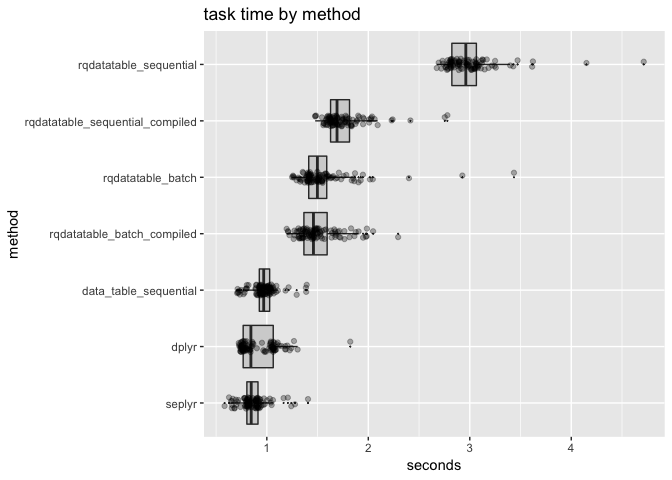

Collecting Expressions, In-Memory Version
================

(In-memory variation of the [Collecting Expressions example](https://github.com/WinVector/rquery/blob/master/extras/CollectExprs.md).)

For in-memory operations sequential operations appear to not be a problem, as they do not contribute to query complexity as in our earlier database examples. This emphasizes that in-memory intuition must be confirmed when working with remote systems.

First set up our packages, database connection, and remote table.

``` r
library("dplyr")
```

    ## Warning: package 'dplyr' was built under R version 3.5.1

    ## 
    ## Attaching package: 'dplyr'

    ## The following objects are masked from 'package:stats':
    ## 
    ##     filter, lag

    ## The following objects are masked from 'package:base':
    ## 
    ##     intersect, setdiff, setequal, union

``` r
library("rquery")
library("microbenchmark")
library("ggplot2")
library("WVPlots")
library("rqdatatable")
library("cdata")
library("data.table")
```

    ## 
    ## Attaching package: 'data.table'

    ## The following objects are masked from 'package:dplyr':
    ## 
    ##     between, first, last

``` r
nrow <- 1000000
d <- data.frame(x = seq_len(nrow))

td <- local_td(d)

tbl <- as.tbl(d)

ncol <- 100
```

[`rqdatatable`](https://CRAN.R-project.org/package=rqdatatable)/[`rquery`](https://CRAN.R-project.org/package=rquery) torture function: add 100 columns to a 1000000 row table. This is implemented using [`data.table`](https://CRAN.R-project.org/package=data.table) in a batch mode.

``` r
rquery_fn <- function(d, ncol) {
  expressions <- paste0("x + ", seq_len(ncol))
  names(expressions) <- paste0("x_", seq_len(ncol))
  ops <- local_td(d) %.>%
    extend_se(., expressions) %.>%
    select_rows_nse(., x == 3)
  d %.>% ops
}

rquery_fn(d, 5)
```

    ##    x x_1 x_2 x_3 x_4 x_5
    ## 1: 3   4   5   6   7   8

The row-selection step is to cut down on the in-memory cost of bringing the result back to `R`. Obviously we could optimize the example away by pivoting the filter to earlier in the example pipeline. We ask the reader to take this example as a stand-in for a more complicated (though nasty) real-world example where such optimizations are not available.

Same torture for [`dplyr`](https://CRAN.R-project.org/package=dplyr).

``` r
dplyr_fn <- function(tbl, ncol) {
  pipeline <- tbl
  xvar <- rlang::sym("x")
  for(i in seq_len(ncol)) {
    res_i <- rlang::sym(paste0("x_", i))
    pipeline <- pipeline %>%
      mutate(., !!res_i := !!xvar + i)
  }
  pipeline <- pipeline %>%
    filter(., x == 3)
  pipeline %>% compute(.)
}

dplyr_fn(tbl, 5)
```

    ## # A tibble: 1 x 6
    ##       x   x_1   x_2   x_3   x_4   x_5
    ##   <int> <int> <int> <int> <int> <int>
    ## 1     3     4     5     6     7     8

We can also collect expressions efficiently using [`seplyr`](https://CRAN.R-project.org/package=seplyr) (`seplyr` is a thin wrapper over `dplyr`, so `seplyr`'s method [`mutate_se()`](https://winvector.github.io/seplyr/reference/mutate_se.html) is essentially instructions how to do the same thing in batch using `dplyr`/`rlang`).

``` r
seplyr_fn <- function(tbl, ncol) {
  expressions <- paste0("x + ", seq_len(ncol))
  names(expressions) <- paste0("x_", seq_len(ncol))
  pipeline <- tbl %>%
    seplyr::mutate_se(., expressions) %>%
    filter(., x == 3)
  pipeline %>% compute(.)
}

seplyr_fn(tbl, 5)
```

    ## # A tibble: 1 x 6
    ##       x   x_1   x_2   x_3   x_4   x_5
    ##   <int> <dbl> <dbl> <dbl> <dbl> <dbl>
    ## 1     3     4     5     6     7     8

And we can also run with [`data.table`](http://r-datatable.com) either sequentially (as below) or in batch (which was the `rqdatatable` result).

``` r
data_table_sequential_fn <- function(d, ncol) {
  # make sure we have a clean copy
  dt <- data.table::copy(as.data.table(d))
  for(i in seq_len(ncol)) {
    dt[, paste0("x_", i) := eval(parse(text=paste0("x + ", i)))]
  }
  dt[x==3, ]
}

data_table_sequential_fn(tbl, 5)
```

    ##    x x_1 x_2 x_3 x_4 x_5
    ## 1: 3   4   5   6   7   8

Time the functions.

``` r
timings <- microbenchmark(
  rqdatatable = rquery_fn(d, ncol),
  dplyr = dplyr_fn(tbl, ncol),
  seplyr = seplyr_fn(tbl, ncol),
  data_table_sequential = data_table_sequential_fn(d, ncol),
  times = 100L)

saveRDS(timings, "CollectExprs_memory_timings.RDS")
```

Present the results.

``` r
print(timings)
```

    ## Unit: milliseconds
    ##                   expr       min        lq      mean    median        uq
    ##            rqdatatable 1327.1253 1481.9942 1630.8643 1568.7860 1715.9464
    ##                  dplyr  752.2442  773.6876  919.7230  833.4448 1094.4451
    ##                 seplyr  598.8906  827.1614  861.3842  855.3084  938.5036
    ##  data_table_sequential  729.8585  952.9952  995.9484  986.7933 1068.0681
    ##       max neval
    ##  2610.145   100
    ##  1675.631   100
    ##  1233.909   100
    ##  1365.402   100

``` r
#autoplot(timings)

timings <- as.data.frame(timings)
timings$seconds <- timings$time/10^9
timings$method <- factor(timings$expr)
timings$method <- reorder(timings$method, timings$seconds)
WVPlots::ScatterBoxPlotH(timings, "seconds", "method", "task time by method")
```



``` r
tratio <- timings %.>%
  project_nse(., 
              groupby = "method", 
              mean_seconds = mean(seconds)) %.>%
  pivot_to_rowrecs(., 
                   columnToTakeKeysFrom = "method", 
                   columnToTakeValuesFrom = "mean_seconds", 
                   rowKeyColumns = NULL) %.>%
  extend_nse(.,
             ratio = dplyr/rqdatatable)

tratio[]
```

    ##    data_table_sequential    dplyr rqdatatable    seplyr     ratio
    ## 1:             0.9959484 0.919723    1.630864 0.8613842 0.5639482

``` r
ratio_str <- sprintf("%.2g", 1/tratio$ratio)
```

`rqdatatable` is about 1.8 times slower than `dplyr` (and the other sequential implementations and even batch implementations) for this task at this scale for this data implementation and configuration. Likely this is due to copying and re-parsing overhead from `rqdatatable` itself (unlikely to be a `data.table` issue).
