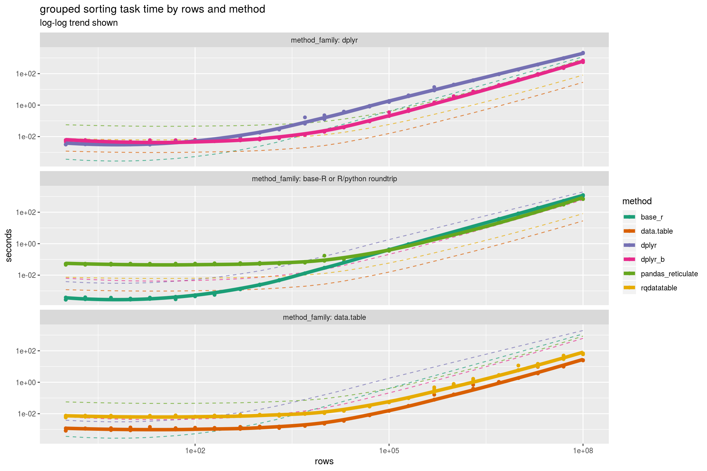
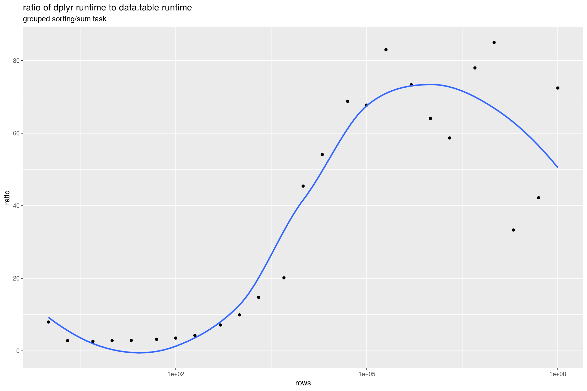

Grouped Rank Filter
================

Amazon EC2 `r4.8xlarge` (244 GiB RAM) run (8-12-2018, 64-bit Ubuntu Server 16.04 LTS (HVM), SSD Volume Type - ami-ba602bc2, R 3.4.4 all packages current).

``` r
# https://cran.r-project.org/web/packages/reticulate/vignettes/r_markdown.html
library("reticulate")
use_python("/home/ruser/miniconda3/bin/python3")
# use_python("/Users/johnmount/anaconda3/bin/python3")
pandas_handle <- reticulate::import("pandas") # don't use as https://github.com/rstudio/reticulate/issues/319

pandas_fn <- py_run_string("
def py_fn(df):
   ord = df.sort_values(by = ['col_a', 'col_b', 'col_c', 'col_x'], ascending = [True, True, True, True])
   ord['rank_col'] = ord.groupby(['col_a', 'col_b', 'col_c']).cumcount()
   return ord[ord.rank_col == 0].ix[:, ['col_a', 'col_b', 'col_c', 'col_x']]
")
do_pandas <- function(d) {
  res <- pandas_fn$py_fn(pandas_handle$DataFrame(d))
  rownames(res) <- NULL
  return(res)
}
```

``` r
library("rqdatatable")
```

    ## Loading required package: rquery

``` r
library("microbenchmark")
library("ggplot2")
library("WVPlots")
library("cdata")
library("dplyr")
```

    ## 
    ## Attaching package: 'dplyr'

    ## The following objects are masked from 'package:stats':
    ## 
    ##     filter, lag

    ## The following objects are masked from 'package:base':
    ## 
    ##     intersect, setdiff, setequal, union

``` r
library("dtplyr")
library("data.table")
```

    ## 
    ## Attaching package: 'data.table'

    ## The following objects are masked from 'package:dplyr':
    ## 
    ##     between, first, last

``` r
set.seed(32523)

mk_data <- function(nrow) {
  alphabet <- paste("sym", seq_len(max(2, floor(nrow^(1/3)))), sep = "_")
  data.frame(col_a = sample(alphabet, nrow, replace=TRUE),
             col_b = sample(alphabet, nrow, replace=TRUE),
             col_c = sample(alphabet, nrow, replace=TRUE),
             col_x = runif(nrow),
             stringsAsFactors = FALSE)
}
```

``` r
# adapted from help(microbenchmark)
my_check <- function(values) {
  values <- lapply(values,
                   function(vi) {
                     vi <- as.data.frame(vi)
                     rownames(vi) <- NULL
                     data.frame(vi) # strip attributes
                   })
  isTRUE(all(sapply(values[-1], function(x) identical(values[[1]], x))))
}
```

``` r
ds <- mk_data(3)

ds %>%  
  group_by(col_a, col_b, col_c) %>% 
  arrange(col_x) %>% 
  filter(row_number() == 1) %>%
  ungroup() %>%
  arrange(col_a, col_b, col_c, col_x)
```

    ## # A tibble: 3 x 4
    ##   col_a col_b col_c col_x
    ##   <chr> <chr> <chr> <dbl>
    ## 1 sym_1 sym_1 sym_1 0.751
    ## 2 sym_2 sym_1 sym_1 0.743
    ## 3 sym_2 sym_2 sym_1 0.542

``` r
ds %>%  
  as.data.table() %>%
  group_by(col_a, col_b, col_c) %>% 
  arrange(col_x) %>% 
  filter(row_number() == 1) %>%
  ungroup() %>%
  arrange(col_a, col_b, col_c, col_x)
```

    ## Error in rank(x, ties.method = "first", na.last = "keep"): argument "x" is missing, with no default

``` r
shift_col <- function(col) { c(col[1], col[-length(col)]) }

base_r <- function(df) {
  rownames(df) <- NULL
  df <- df[order(df$col_a, df$col_b, df$col_c, df$col_x), , drop = FALSE]
  rownames(df) <- NULL
  first <- (df$col_a != shift_col(df$col_a)) | 
    (df$col_b != shift_col(df$col_b)) | 
    (df$col_c != shift_col(df$col_c))
  first[[1]] <- TRUE
  df <- df[first, , drop = FALSE]
  rownames(df) <- NULL
  df
}
```

``` r
pow <- 8
rds_name <- "GroupedRankFilter2_runs.RDS"
if(!file.exists(rds_name)) {
  szs <- expand.grid(a = c(1,2,5), b = 10^{0:pow}) 
  szs <- sort(unique(szs$a * szs$b))
  szs <- szs[szs<=10^pow]
  runs <- lapply(
    rev(szs),
    function(sz) {
      gc()
      d <- mk_data(sz)
      ti <- microbenchmark(
        base_r = {
          base_r(d)
        },
        data.table = { 
          # https://stackoverflow.com/questions/16325641/how-to-extract-the-first-n-rows-per-group
          d %.>% 
            as.data.table(.) %.>% 
            setorder(., col_a, col_b, col_c, col_x) %.>%
            .[, .SD[1], by=list(col_a, col_b, col_c)] 
        },
        rqdatatable = { 
          ops <- local_td(d) %.>%
            pick_top_k(., 
                       k = 1L,
                       orderby = "col_x",
                       partitionby = c("col_a", "col_b", "col_c"),
                       keep_order_column = FALSE) %.>%
            orderby(., c("col_a", "col_b", "col_c", "col_x"))
          d %.>% ops
        },
        dplyr = {
          d %>% 
            group_by(col_a, col_b, col_c) %>% 
            arrange(col_x) %>% 
            filter(row_number() == 1) %>%
            ungroup() %>%
            arrange(col_a, col_b, col_c, col_x)
        },
        dplyr_b = {
          d %>% 
            arrange(col_x) %>% 
            group_by(col_a, col_b, col_c) %>% 
            mutate(rn = row_number()) %>%
            ungroup() %>%
            filter(rn == 1) %>%
            select(col_a, col_b, col_c, col_x) %>%
            arrange(col_a, col_b, col_c, col_x)
        },
        pandas_reticulate = {
          do_pandas(d)
        },
        times = 3L,
        check = my_check)
      ti <- as.data.frame(ti)
      ti$rows <- sz
      ti
    })
  saveRDS(runs, rds_name)
} else {
  runs <- readRDS(rds_name)
}
```

``` r
timings <- do.call(rbind, runs)
timings$seconds <- timings$time/1e+9
timings$method <- factor(timings$expr,
                         levels = c("dplyr", "dplyr_b",
                                    "base_r", "pandas_reticulate",
                                    "rqdatatable", "data.table"))
method_map <- c(dplyr = "dplyr", 
                dplyr_b = "dplyr",
                pandas_reticulate = "base-R or R/python roundtrip",
                data.table =   "data.table",
                rqdatatable = "data.table",   
                base_r  = "base-R or R/python roundtrip")
timings$method_family <- method_map[as.character(timings$method)]
timings$method_family <- reorder(timings$method_family, -timings$seconds)
rowset <- sort(unique(timings$rows))
smooths <- lapply(
  unique(as.character(timings$method)),
  function(mi) {
    ti <- timings[timings$method == mi, , drop = FALSE]
    ti$rows <- log(ti$rows)
    si <- loess(log(seconds) ~ rows, data = ti)
    pi <- data.frame(
      method = mi,
      rows = log(rowset),
      stringsAsFactors = FALSE)
    pi$seconds <- exp(predict(si, newdata = pi))
    pi$rows <- rowset
    pi
  })
smooths <- do.call(rbind, smooths)

ggplot(data = timings, aes(x = rows, y = seconds)) +
  geom_line(data = smooths,
            alpha = 0.7,
            linetype = 2,
            aes(group = method, color = method)) +
  geom_point(data = timings, aes(color = method)) + 
  geom_smooth(data = timings, aes(color = method),
              se = FALSE, size = 2) +
  scale_x_log10() +
  scale_y_log10() +
  scale_color_manual(values = 
                       c("#1b9e77", "#d95f02",
                         "#7570b3", "#e7298a",
                         "#66a61e", "#e6ab02")) +
  ggtitle("grouped sorting task time by rows and method",
          subtitle = "log-log trend shown") +
  facet_wrap(~method_family, ncol=1, labeller = "label_both")
```

    ## `geom_smooth()` using method = 'loess' and formula 'y ~ x'



``` r
means <- timings %.>%
  project_nse(., 
              groupby = c("method", "rows"), 
              seconds = mean(seconds)) %.>%
  pivot_to_rowrecs(., 
                   columnToTakeKeysFrom = "method",
                   columnToTakeValuesFrom = "seconds",
                   rowKeyColumns = "rows") %.>%
  extend_nse(., 
             ratio = dplyr/data.table) %.>%
  orderby(., "rows")

knitr::kable(means)
```

|   rows|       base\_r|  data.table|         dplyr|     dplyr\_b|  pandas\_reticulate|  rqdatatable|       ratio|
|------:|-------------:|-----------:|-------------:|------------:|-------------------:|------------:|-----------:|
|  1e+00|     0.0003113|   0.0009637|     0.0031574|    0.0055393|           0.0501983|    0.0066208|    3.276376|
|  2e+00|     0.0003414|   0.0011372|     0.0038860|    0.0055653|           0.0494733|    0.0070875|    3.417285|
|  5e+00|     0.0003282|   0.0010288|     0.0034249|    0.0043944|           0.0510521|    0.0067176|    3.329221|
|  1e+01|     0.0002965|   0.0011486|     0.0032149|    0.0045136|           0.0517832|    0.0060016|    2.799035|
|  2e+01|     0.0003464|   0.0012271|     0.0033152|    0.0050457|           0.0503389|    0.0070496|    2.701645|
|  5e+01|     0.0003583|   0.0011184|     0.0045808|    0.0054872|           0.0492349|    0.0075787|    4.095936|
|  1e+02|     0.0004843|   0.0012012|     0.0049348|    0.0056556|           0.0516155|    0.0064548|    4.108144|
|  2e+02|     0.0005905|   0.0011561|     0.0062533|    0.0055023|           0.0529932|    0.0071371|    5.408877|
|  5e+02|     0.0013023|   0.0012649|     0.0094414|    0.0061719|           0.0552569|    0.0079750|    7.463914|
|  1e+03|     0.0024185|   0.0013965|     0.0180815|    0.0071669|           0.0543741|    0.0085220|   12.948150|
|  2e+03|     0.0047565|   0.0014291|     0.0303777|    0.0083027|           0.0575584|    0.0083256|   21.255900|
|  5e+03|     0.0130528|   0.0017762|     0.1036929|    0.0134613|           0.0668064|    0.0100453|   58.379159|
|  1e+04|     0.0294946|   0.0023937|     0.1630009|    0.0211392|           0.1122043|    0.0121026|   68.095737|
|  2e+04|     0.0678060|   0.0036646|     0.3650219|    0.0383000|           0.1060870|    0.0155402|   99.606449|
|  5e+04|     0.1951214|   0.0079801|     0.8631357|    0.0932227|           0.1920073|    0.0290732|  108.161147|
|  1e+05|     0.4375382|   0.0152866|     1.6712007|    0.2522826|           0.3535280|    0.0529442|  109.324412|
|  2e+05|     0.9395333|   0.0312452|     3.9630044|    0.4572895|           0.7447689|    0.0996658|  126.835586|
|  5e+05|     2.4665039|   0.1060519|    10.5471255|    1.3978909|           2.0588585|    0.3590697|   99.452503|
|  1e+06|     5.3376018|   0.1668063|    19.9772889|    3.2666436|           4.4407827|    0.7165523|  119.763417|
|  2e+06|    12.1579697|   0.4868541|    37.5771802|    6.8636681|           9.9671886|    1.3760568|   77.183658|
|  5e+06|    37.3431036|   1.0472313|    92.6392141|   17.6781663|          27.0857291|    2.8426404|   88.461084|
|  1e+07|    83.3918366|   1.8500918|   183.9038037|   40.4214951|          55.8798015|    7.7464071|   99.402530|
|  2e+07|   187.6904502|   5.6125706|   377.9531665|   89.7174248|         117.2379095|   12.2504343|   67.340474|
|  5e+07|   520.2487289|  10.2391356|   951.5076417|  232.1284876|         306.3976887|   36.6374724|   92.928513|
|  1e+08|  1155.4732601|  24.9863293|  2049.6780785|  587.2931382|         698.9196756|   63.2539771|   82.031980|

``` r
ggplot(data = means, aes(x = rows, y = ratio)) +
  geom_point() + 
  geom_smooth(se = FALSE) +
  scale_x_log10() + 
  ggtitle("ratio of dplyr runtime to data.table runtime",
          subtitle = "grouped sorting/sum task")
```

    ## `geom_smooth()` using method = 'loess' and formula 'y ~ x'


