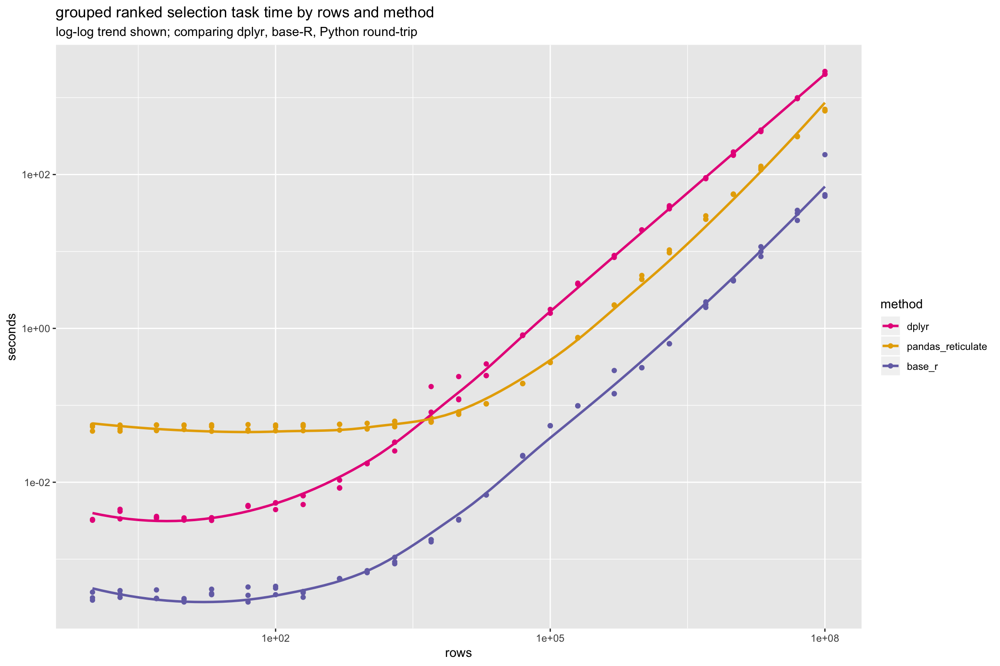
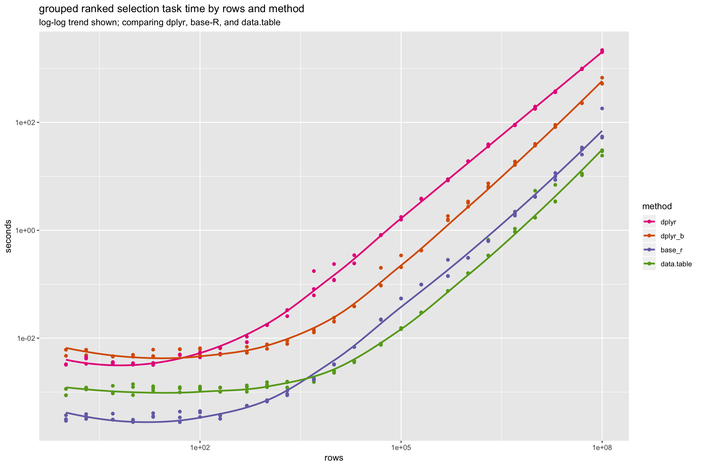
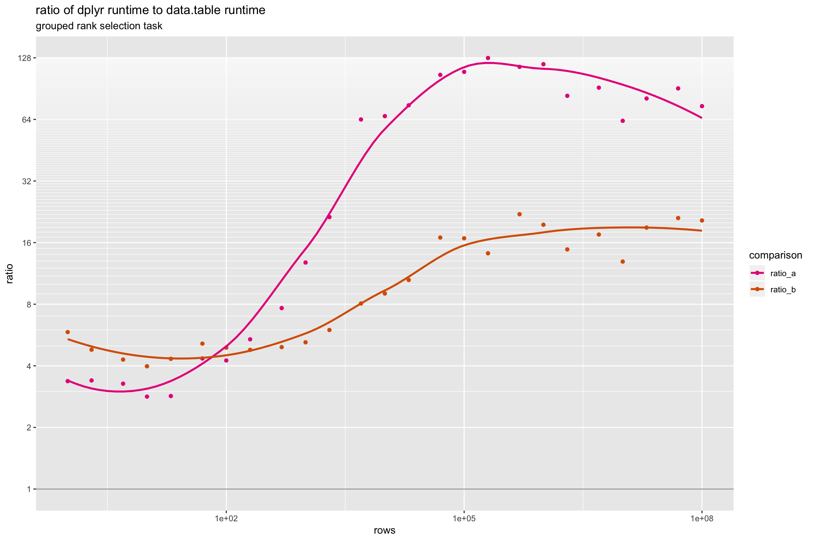
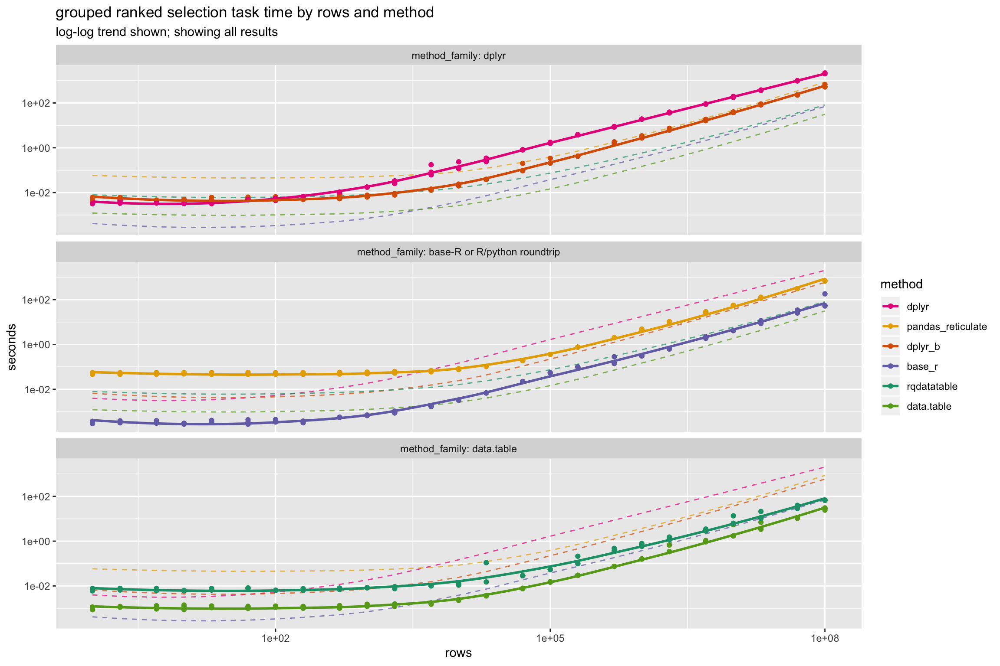

Timings of a Grouped Rank Filter Task
================

Introduction
============

[This note](https://github.com/WinVector/rqdatatable/blob/master/extras/GroupedRankFilter2.md) shares an experiment comparing the performance of a number of data processing systems available in [<code>R</code>](https://www.r-project.org). Our notional or example problem is finding the top ranking item per group (group defined by three string columns, and order defined by a single numeric column). This is a common and often needed task.

Comparisons
===========

First let's compare three methods on the same grouped ranking problem.

-   "Base-<code>R</code>" (term defined as <code>R</code> plus just core packages, earlier results [here](http://www.win-vector.com/blog/2018/01/base-r-can-be-fast/)). We are using `base::order()` with the option "`method = "auto"`" (as described [here](http://www.win-vector.com/blog/2018/08/r-tip-use-radix-sort/)).
-   [<code>dplyr</code>](https://CRAN.R-project.org/package=dplyr).
-   The seemingly silly idea of using [<code>reticulate</code>](https://CRAN.R-project.org/package=reticulate) to ship the data to <code>Python</code>, and then using [<code>Pandas</code>](https://pandas.pydata.org) to do the work, and finally bring the result back to <code>R</code>.

We will plot the run-times (in seconds) of these three solutions to the same task as a function of the number of rows in the problem. For all tasks shorter run-times (being lower on the graph) is better. Since we are plotting a large range of values (1 through 100,000,000 rows) we will present the data as a "log-log" plot.



Notice <code>dplyr</code> is slower (higher up on the graph) than base <code>R</code> for all problem scales tested (1 row through 100,000,000 rows). Height differences on a <code>log-y</code> scaled graph such as this represent ratios of run-times and we can see the ratio of <code>dplyr</code> to base-<code>R</code> runtime is large (often over 40 to 1).

Also notice by the time we get the problem size up to 5,000 rows even sending the data to <code>Python</code> and back for <code>Pandas</code> processing is faster than <code>dplyr</code>.

Note: in this article "<code>pandas</code> timing" means the time it would take an <code>R</code> process to use <code>Pandas</code> for data manipulation. This includes the extra overhead of moving the data from <code>R</code> to <code>Python</code>/<code>Pandas</code> and back. This is always going to be slower than <code>Pandas</code> itself as it includes extra overhead. We are *not* saying `R` users should round trip their data through `Python` and (as we will discuss later) these performance numbers alone are not a reason for `R` users to switch to `Python`. It *does* indicate that clients may not always be well-served by a pure-`dplyr` or pure-`tidyverse` approach. As an `R` advocate, I like `R` to have its best fair chance in the market, regardless of loyalty or dis-loyalty to any one set of packages.

All runs were performed on an Amazon EC2 `r4.8xlarge` (244 GiB RAM) 64-bit Ubuntu Server 16.04 LTS (HVM), SSD Volume Type - ami-ba602bc2. We used R 3.4.4, with all packages current as of 8-20-2018 (the date of the experiment).

We are not testing [<code>dtplyr</code>](https://CRAN.R-project.org/package=dtplyr) for the simple reason it did not work with the <code>dplyr</code> pipeline as written. We demonstrate this issue below.

``` r
ds <- mk_data(3)

dplyr_pipeline <- . %>%
  group_by(col_a, col_b, col_c) %>% 
  arrange(col_x) %>% 
  filter(row_number() == 1) %>%
  ungroup() %>%
  arrange(col_a, col_b, col_c, col_x)

ds %>% 
  dplyr_pipeline
```

    ## # A tibble: 3 x 4
    ##   col_a col_b col_c col_x
    ##   <chr> <chr> <chr> <dbl>
    ## 1 sym_1 sym_1 sym_1 0.751
    ## 2 sym_2 sym_1 sym_1 0.743
    ## 3 sym_2 sym_2 sym_1 0.542

``` r
ds %>%  
  as.data.table() %>% 
  dplyr_pipeline
```

    ## Error in data.table::is.data.table(data): argument "x" is missing, with no default

It is important to note the reason base-`R` is in the running is that Matt Dowle and Arun Srinivasan of the <code>data.table</code> team generously ported their radix sorting code into base-`R`. Please see `help(sort)` for details. This sharing of one of `data.table`'s more important features (fast radix sorting) back into `R` itself is a very big deal.

For our example we used what I consider a natural or idiomatic <code>dplyr</code> solution to the problem. We saw that code or pipeline just above. That code may not be preferred, as <code>dplyr</code> has [known (unfixed) issues with filtering in the presence of grouping](https://github.com/tidyverse/dplyr/issues/3294). Let's try to work around that with the following code (pivoting as many operations out of the grouped data section of the pipeline as practical).

``` r
d %>% 
  arrange(col_x) %>% 
  group_by(col_a, col_b, col_c) %>% 
  mutate(rn = row_number()) %>%
  ungroup() %>%
  filter(rn == 1) %>%
  select(col_a, col_b, col_c, col_x) %>%
  arrange(col_a, col_b, col_c, col_x)
```

We will call the above solution "<code>dplyr\_b</code>". A new comparison including "<code>dplyr\_b</code>" is given below.



In the above graph we added <code>data.table</code> results and left out the earlier <code>Pandas</code> results. It is already known that working with <code>data.table</code> in `R` is typically competitive with (and sometimes faster than) working with `Pandas` in `python` (some results are given [here](https://github.com/Rdatatable/data.table/wiki/Benchmarks-%3A-Grouping), [here](https://www.statworx.com/de/blog/pandas-vs-data-table-a-study-of-data-frames/)); so `R` users should *not* be seriously considering round-tripping their data through `Python` to get access to `Pandas`, and (at least with <code>data.table</code>) `R` users should not have data manipulation performance as a reason to abandon `R` for `Python`.

There are at least 2 ways to think about the relation of the `dplyr` and `dplyr_b` solutions. One interpretation is we found a way to speed up our `dplyr` code by a factor of 5. The other interpretation is that small variations in `dplyr` pipeline specification can easily affect your run-times by a factor of 5. At no scale tested does either of the <code>dplyr</code> solutions match the performance of either of base-<code>R</code> or <code>data.table</code>. The ratio of the runtime of the first (or more natural) <code>dplyr</code> solution over the <code>data.table</code> runtime (<code>data.table</code> being by far the best solution) is routinely over 80 to 1.

We can take a closer look at the ratio of run-times. In our next graph we present the ratio two `dplyr` solution run times to the `data.table` solution run-time. We will call the ratio of the runtime of the first `dplyr` solution over the `data.table` run time "`ratio_a`"; and call the ratio of the runtime of the second (improved) `dplyr` solution over the `data.table` run time "`ratio_b`".



A practical lesson is to look at is what happens at 5 million rows (times in seconds).

|                    |         |
|:-------------------|:--------|
| rows               | 5000000 |
| base\_r            | 2.04    |
| data.table         | 0.981   |
| dplyr              | 89.8    |
| dplyr\_b           | 17.2    |
| pandas\_reticulate | 27.2    |
| rqdatatable        | 3.05    |
| ratio\_a           | 91.5    |
| ratio\_b           | 17.5    |

At this scale `data.table` takes about 1 second. Base-`R` takes about 2 seconds (longer, but tolerable). `dplyr` takes 90 to 17 seconds (depending on which variation you use). These are significantly different user experiences. We have also included the timing for [`rqdatatable`](https://github.com/WinVector/rqdatatable), which relies on `data.table` as its implementation *and* has some data-copying overhead (in this case leading to a total runtime of 3 seconds).

Conclusion
==========

In our simple example we have seen very large differences in performance driven by seemingly small code changes. This emphasizes the need to benchmark one's own tasks and workflows. Choosing tools based on mere preference or anecdote may not be safe. Also, even if one does not perform such tests, clients often do see and experience overall run times when scheduling jobs and provisioning infrastructure. Even if you do not measure, somebody else may be measuring later.

We must emphasize that performance of these systems will vary from example to example. However, the above results are consistent with what we have seen (informally) in production systems. In comparing performance one should look to primary sources (experiments actually run, such as this) over repeating indirect and unsupported (in the sense of no shared code or data) claims (or at least run such claims down to their primary sources).

All Results
===========

Full results are below (and all code and results are [here](https://github.com/WinVector/rqdatatable/blob/master/extras/GroupedRankFilter2.md) and [here](https://github.com/WinVector/rqdatatable/blob/master/extras/GroupedRankFilter2.Rmd)). Times below are reported in seconds.



|   rows|     base\_r|  data.table|         dplyr|     dplyr\_b|  pandas\_reticulate|  rqdatatable|
|------:|-----------:|-----------:|-------------:|------------:|-------------------:|------------:|
|  1e+00|   0.0003267|   0.0009635|     0.0032435|    0.0056354|           0.0515041|    0.0068414|
|  2e+00|   0.0003528|   0.0011762|     0.0039913|    0.0056410|           0.0502828|    0.0073060|
|  5e+00|   0.0003385|   0.0010677|     0.0034936|    0.0045818|           0.0525998|    0.0068656|
|  1e+01|   0.0002953|   0.0011747|     0.0033224|    0.0046752|           0.0528985|    0.0061786|
|  2e+01|   0.0003701|   0.0011826|     0.0033672|    0.0051183|           0.0515722|    0.0072840|
|  5e+01|   0.0003502|   0.0011314|     0.0049174|    0.0058086|           0.0501480|    0.0079664|
|  1e+02|   0.0004028|   0.0011917|     0.0050619|    0.0058480|           0.0516048|    0.0063728|
|  2e+02|   0.0003551|   0.0011431|     0.0061629|    0.0054713|           0.0521349|    0.0069566|
|  5e+02|   0.0005584|   0.0011976|     0.0091727|    0.0059109|           0.0536094|    0.0075940|
|  1e+03|   0.0006866|   0.0013731|     0.0175628|    0.0071574|           0.0525276|    0.0083290|
|  2e+03|   0.0009508|   0.0014346|     0.0306059|    0.0085873|           0.0587110|    0.0085833|
|  5e+03|   0.0017535|   0.0016617|     0.1062600|    0.0134023|           0.0633362|    0.0103101|
|  1e+04|   0.0032618|   0.0023880|     0.1585770|    0.0215488|           0.0783897|    0.0117951|
|  2e+04|   0.0068442|   0.0036975|     0.2773583|    0.0388676|           0.1047436|    0.0781040|
|  5e+04|   0.0220546|   0.0076919|     0.8126197|    0.1302733|           0.1919448|    0.0287966|
|  1e+05|   0.0542680|   0.0150029|     1.6392750|    0.2519953|           0.3619354|    0.0539985|
|  2e+05|   0.0984879|   0.0297835|     3.8033730|    0.4226258|           0.7554858|    0.1376937|
|  5e+05|   0.1888721|   0.0750671|     8.6772974|    1.6534837|           2.0085191|    0.3987250|
|  1e+06|   0.3081734|   0.1597136|    19.0250048|    3.1239851|           4.5261344|    0.6841254|
|  2e+06|   0.6314713|   0.4500708|    37.5676553|    6.6708313|           9.9416448|    1.2899695|
|  5e+06|   2.0422985|   0.9812918|    89.7617447|   17.1999063|          27.1812446|    3.0494435|
|  1e+07|   4.1903058|   2.9464046|   185.6145993|   38.0824507|          55.4756717|    8.5571020|
|  2e+07|  10.0234737|   4.5928288|   371.9769376|   87.0174476|         121.7105373|   14.2129314|
|  5e+07|  30.3027149|  10.7915545|   978.9227351|  227.6743024|         313.1767425|   33.9917370|
|  1e+08|  96.0148219|  27.9374640|  2075.8621812|  573.3556189|         683.8245597|   66.8635493|

|   rows|  data.table|         dplyr|     dplyr\_b|    ratio\_a|   ratio\_b|
|------:|-----------:|-------------:|------------:|-----------:|----------:|
|  1e+00|   0.0009635|     0.0032435|    0.0056354|    3.366340|   5.848884|
|  2e+00|   0.0011762|     0.0039913|    0.0056410|    3.393389|   4.795870|
|  5e+00|   0.0010677|     0.0034936|    0.0045818|    3.272137|   4.291283|
|  1e+01|   0.0011747|     0.0033224|    0.0046752|    2.828368|   3.980007|
|  2e+01|   0.0011826|     0.0033672|    0.0051183|    2.847248|   4.327989|
|  5e+01|   0.0011314|     0.0049174|    0.0058086|    4.346260|   5.133901|
|  1e+02|   0.0011917|     0.0050619|    0.0058480|    4.247761|   4.907425|
|  2e+02|   0.0011431|     0.0061629|    0.0054713|    5.391524|   4.786483|
|  5e+02|   0.0011976|     0.0091727|    0.0059109|    7.659537|   4.935831|
|  1e+03|   0.0013731|     0.0175628|    0.0071574|   12.790704|   5.212602|
|  2e+03|   0.0014346|     0.0306059|    0.0085873|   21.333661|   5.985711|
|  5e+03|   0.0016617|     0.1062600|    0.0134023|   63.946449|   8.065404|
|  1e+04|   0.0023880|     0.1585770|    0.0215488|   66.404714|   9.023651|
|  2e+04|   0.0036975|     0.2773583|    0.0388676|   75.011801|  10.511779|
|  5e+04|   0.0076919|     0.8126197|    0.1302733|  105.646123|  16.936417|
|  1e+05|   0.0150029|     1.6392750|    0.2519953|  109.263959|  16.796454|
|  2e+05|   0.0297835|     3.8033730|    0.4226258|  127.700648|  14.189929|
|  5e+05|   0.0750671|     8.6772974|    1.6534837|  115.593808|  22.026728|
|  1e+06|   0.1597136|    19.0250048|    3.1239851|  119.119507|  19.559920|
|  2e+06|   0.4500708|    37.5676553|    6.6708313|   83.470539|  14.821737|
|  5e+06|   0.9812918|    89.7617447|   17.1999063|   91.473038|  17.527820|
|  1e+07|   2.9464046|   185.6145993|   38.0824507|   62.996982|  12.925058|
|  2e+07|   4.5928288|   371.9769376|   87.0174476|   80.990813|  18.946373|
|  5e+07|  10.7915545|   978.9227351|  227.6743024|   90.711929|  21.097452|
|  1e+08|  27.9374640|  2075.8621812|  573.3556189|   74.303887|  20.522823|

Appendix
========

Comments can be found [here](http://www.win-vector.com/blog/2018/08/timings-of-a-grouped-rank-filter-task/), and some follow-up timings [here](https://github.com/WinVector/rqdatatable/blob/master/extras/GroupedRankFilter2b.md).
