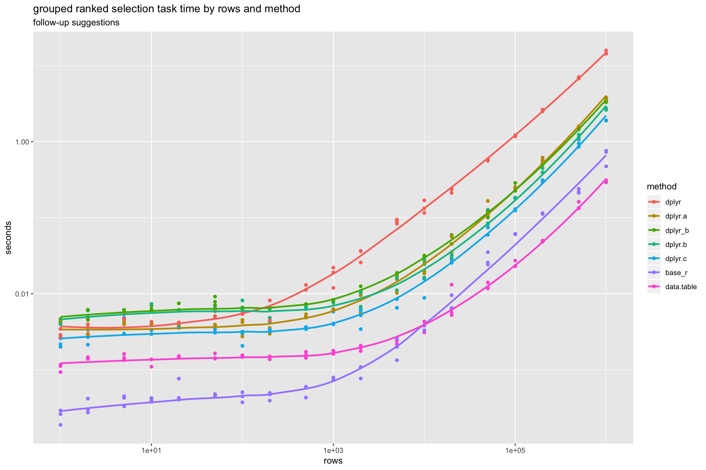

Timings of a Grouped Rank Filter Task (extra timings)
================

Follow-ons to [timining article](http://www.win-vector.com/blog/2018/08/timings-of-a-grouped-rank-filter-task/).

Run on a Mac mini (Late 2014), mac OS High Sierra Version 10.13.6, 2.8 GHz Intel Core i5, 8 GB 1600 MHz DD3 RAM, R version 3.5.0, all packages CRAN current as of 8-24-2018 (date of the run).

|   rows|    base\_r|  data.table|       dplyr|    dplyr.a|    dplyr.b|    dplyr.c|   dplyr\_b|
|------:|----------:|-----------:|-----------:|----------:|----------:|----------:|----------:|
|  1e+00|  0.0002470|   0.0010742|   0.0029943|  0.0031809|  0.0040186|  0.0022563|  0.0044148|
|  2e+00|  0.0003313|   0.0014231|   0.0038599|  0.0031384|  0.0052035|  0.0027281|  0.0056127|
|  5e+00|  0.0004026|   0.0014639|   0.0048797|  0.0040526|  0.0059370|  0.0036026|  0.0060995|
|  1e+01|  0.0004013|   0.0012798|   0.0041586|  0.0039139|  0.0063424|  0.0032077|  0.0064551|
|  2e+01|  0.0005327|   0.0014933|   0.0041455|  0.0039698|  0.0060140|  0.0036182|  0.0065667|
|  5e+01|  0.0004635|   0.0014892|   0.0053626|  0.0037429|  0.0062610|  0.0032970|  0.0080441|
|  1e+02|  0.0004425|   0.0015018|   0.0054633|  0.0038284|  0.0069292|  0.0027485|  0.0063305|
|  2e+02|  0.0004549|   0.0014472|   0.0064043|  0.0037603|  0.0051118|  0.0032940|  0.0065047|
|  5e+02|  0.0005361|   0.0015776|   0.0104993|  0.0050768|  0.0059973|  0.0035378|  0.0063656|
|  1e+03|  0.0007544|   0.0017001|   0.0176671|  0.0062135|  0.0078708|  0.0046064|  0.0081509|
|  2e+03|  0.0009769|   0.0019333|   0.0329028|  0.0078628|  0.0078217|  0.0048941|  0.0113724|
|  5e+03|  0.0019663|   0.0024131|   0.0887155|  0.0143565|  0.0127615|  0.0078553|  0.0180241|
|  1e+04|  0.0036559|   0.0035723|   0.1394438|  0.0217666|  0.0230061|  0.0148798|  0.0300852|
|  2e+04|  0.0074431|   0.0080109|   0.2283989|  0.0502327|  0.0313238|  0.0272954|  0.0536791|
|  5e+04|  0.0283719|   0.0126168|   0.5731437|  0.1264591|  0.0980578|  0.0698104|  0.1138654|
|  1e+05|  0.0609437|   0.0244684|   1.1894820|  0.2477819|  0.1813457|  0.1461624|  0.2463448|
|  2e+05|  0.1138001|   0.0492780|   2.5809338|  0.5841499|  0.4125598|  0.3020178|  0.5090304|
|  5e+05|  0.2238009|   0.1433038|   6.9091637|  1.5782126|  1.1714595|  0.9569284|  1.4743319|
|  1e+06|  0.6558543|   0.3023460|  14.8725800|  3.7131609|  2.7017660|  1.8995092|  3.4221893|
