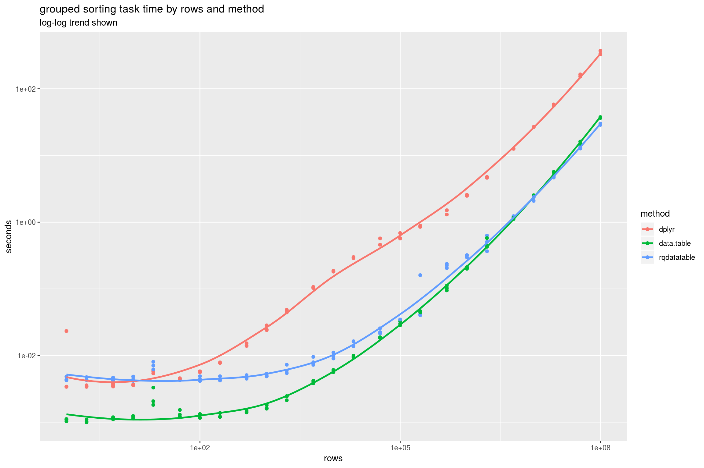
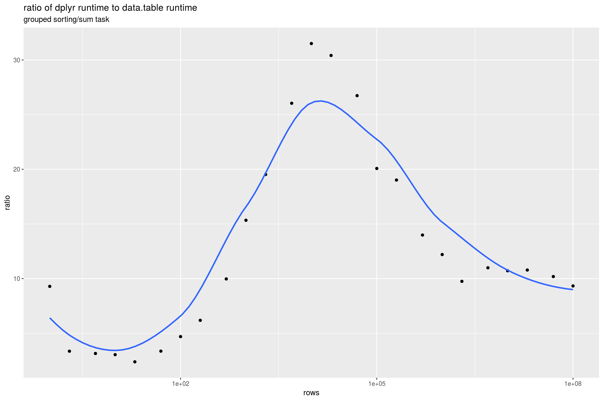
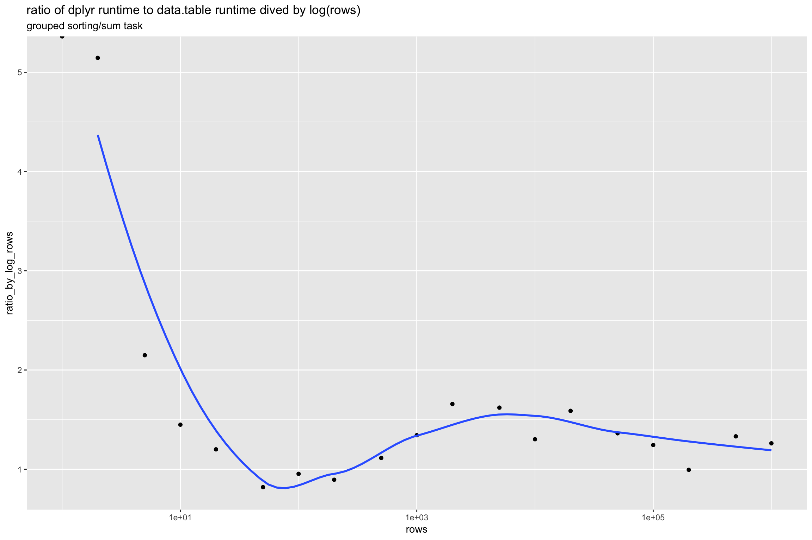

Grouped Sorting
================

Amazon EC2 `r4.8xlarge` (244 GiB RAM) run (8-12-2018, 64-bit Ubuntu Server 16.04 LTS (HVM), SSD Volume Type - ami-ba602bc2, R 3.4.4 all packages current).

``` r
library("rqdatatable")
```

    ## Loading required package: rquery

``` r
library("microbenchmark")
library("ggplot2")
library("WVPlots")
library("cdata")
library("dplyr")
```

    ## Warning: package 'dplyr' was built under R version 3.5.1

    ## 
    ## Attaching package: 'dplyr'

    ## The following objects are masked from 'package:stats':
    ## 
    ##     filter, lag

    ## The following objects are masked from 'package:base':
    ## 
    ##     intersect, setdiff, setequal, union

``` r
library("data.table")
```

    ## 
    ## Attaching package: 'data.table'

    ## The following objects are masked from 'package:dplyr':
    ## 
    ##     between, first, last

``` r
set.seed(32523)

mk_data <- function(nrow) {
  alphabet <- paste("sym", seq_len(max(2, floor(nrow^(1/3)))), sep = "_")
  data.frame(col_a = sample(alphabet, nrow, replace=TRUE),
             col_b = sample(alphabet, nrow, replace=TRUE),
             col_c = sample(alphabet, nrow, replace=TRUE),
             col_x = runif(nrow),
             stringsAsFactors = FALSE)
}
```

``` r
# adapted from help(microbenchmark)
my_check <- function(values) {
  values <- lapply(values,
                   function(vi) {
                     vi <- as.data.frame(vi)
                     rownames(vi) <- NULL
                     vi
                   })
  isTRUE(all(sapply(values[-1], function(x) identical(values[[1]], x))))
}
```

``` r
pow <- 6
rds_name <- "GroupedSorting_runs.RDS"
if(!file.exists(rds_name)) {
  szs <- expand.grid(a = c(1,2,5), b = 10^{0:pow}) 
  szs <- sort(unique(szs$a * szs$b))
  szs <- szs[szs<=10^pow]
  runs <- lapply(
    szs,
    function(sz) {
      d <- mk_data(sz)
      ti <- microbenchmark(
        data.table = { 
          d %.>% 
            as.data.table(.) %.>% 
            setorder(., col_x) %.>%
            .[, running := cumsum(col_x), by=list(col_a, col_b, col_c)] %.>%
            setorder(., col_a, col_b, col_c, col_x)
        },
        rqdatatable = { 
          d %.>%
            extend_nse(., 
                       running = cumsum(col_x),
                       partitionby = c("col_a", "col_b", "col_c"),
                       orderby = "col_x") %.>%
            orderby(., c("col_a", "col_b", "col_c", "col_x"))
        },
        dplyr = {
          d %>% 
            group_by(col_a, col_b, col_c) %>% 
            arrange(col_x) %>% 
            mutate(running = cumsum(col_x)) %>% 
            arrange(col_a, col_b, col_c, col_x)
        },
        times = 3L,
        check = my_check)
      ti <- as.data.frame(ti)
      ti$rows <- sz
      ti
    })
  saveRDS(runs, rds_name)
} else {
  runs <- readRDS(rds_name)
}
```

``` r
timings <- do.call(rbind, runs)
timings$seconds <- timings$time/1e+9
timings$method <- factor(timings$expr)
timings$method <- reorder(timings$method, -timings$seconds)

ggplot(data = timings, aes(x = rows, y = seconds, color = method)) +
  geom_point() + 
  geom_smooth(se = FALSE) +
  scale_x_log10() + scale_y_log10() +
  ggtitle("grouped sorting task time by rows and method",
          subtitle = "log-log trend shown")
```

    ## `geom_smooth()` using method = 'loess' and formula 'y ~ x'



``` r
means <- timings %.>%
  project_nse(., 
              groupby = c("method", "rows"), 
              seconds = mean(seconds)) %.>%
  pivot_to_rowrecs(., 
                   columnToTakeKeysFrom = "method",
                   columnToTakeValuesFrom = "seconds",
                   rowKeyColumns = "rows") %.>%
  extend_nse(., 
             ratio = dplyr/data.table,
             ratio_by_log_rows = ratio/log(rows)) %.>%
  orderby(., "rows")

knitr::kable(means)
```

|   rows|  data.table|       dplyr|  rqdatatable|      ratio|  ratio\_by\_log\_rows|
|------:|-----------:|-----------:|------------:|----------:|---------------------:|
|  1e+00|   0.0009357|   0.0031369|    0.0044632|   3.352339|                   Inf|
|  2e+00|   0.0009609|   0.0034266|    0.0040004|   3.565853|             5.1444385|
|  5e+00|   0.0012906|   0.0044638|    0.0057265|   3.458624|             2.1489641|
|  1e+01|   0.0013335|   0.0044497|    0.0062939|   3.336738|             1.4491269|
|  2e+01|   0.0014679|   0.0052786|    0.0055861|   3.595991|             1.2003714|
|  5e+01|   0.0015914|   0.0051036|    0.0063619|   3.206983|             0.8197762|
|  1e+02|   0.0014169|   0.0062252|    0.0060188|   4.393479|             0.9540319|
|  2e+02|   0.0016120|   0.0076368|    0.0059865|   4.737395|             0.8941320|
|  5e+02|   0.0018010|   0.0124613|    0.0062078|   6.919066|             1.1133552|
|  1e+03|   0.0022258|   0.0206443|    0.0063897|   9.274799|             1.3426646|
|  2e+03|   0.0034286|   0.0431910|    0.0086674|  12.597145|             1.6573223|
|  5e+03|   0.0065410|   0.0902933|    0.0132713|  13.804191|             1.6207441|
|  1e+04|   0.0102951|   0.1234932|    0.0161347|  11.995322|             1.3023755|
|  2e+04|   0.0191508|   0.3012782|    0.0271349|  15.731874|             1.5885186|
|  5e+04|   0.0498521|   0.7347170|    0.0533672|  14.737936|             1.3621292|
|  1e+05|   0.1039247|   1.4884310|    0.1099531|  14.322210|             1.2440113|
|  2e+05|   0.2630986|   3.1923535|    0.2198142|  12.133678|             0.9940689|
|  5e+05|   0.4738891|   8.2792478|    0.4846414|  17.470856|             1.3313803|
|  1e+06|   0.9598821|  16.7222401|    1.0457160|  17.421139|             1.2609841|

``` r
ggplot(data = means, aes(x = rows, y = ratio)) +
  geom_point() + 
  geom_smooth(se = FALSE) +
  scale_x_log10() + 
  ggtitle("ratio of dplyr runtime to data.table runtime",
          subtitle = "grouped sorting/sum task")
```

    ## `geom_smooth()` using method = 'loess' and formula 'y ~ x'



``` r
ggplot(data = means, aes(x = rows, y = ratio_by_log_rows)) +
  geom_point() + 
  geom_smooth(se = FALSE) +
  scale_x_log10() + 
  ggtitle("ratio of dplyr runtime to data.table runtime dived by log(rows)",
          subtitle = "grouped sorting/sum task")
```

    ## `geom_smooth()` using method = 'loess' and formula 'y ~ x'

    ## Warning: Removed 1 rows containing non-finite values (stat_smooth).


