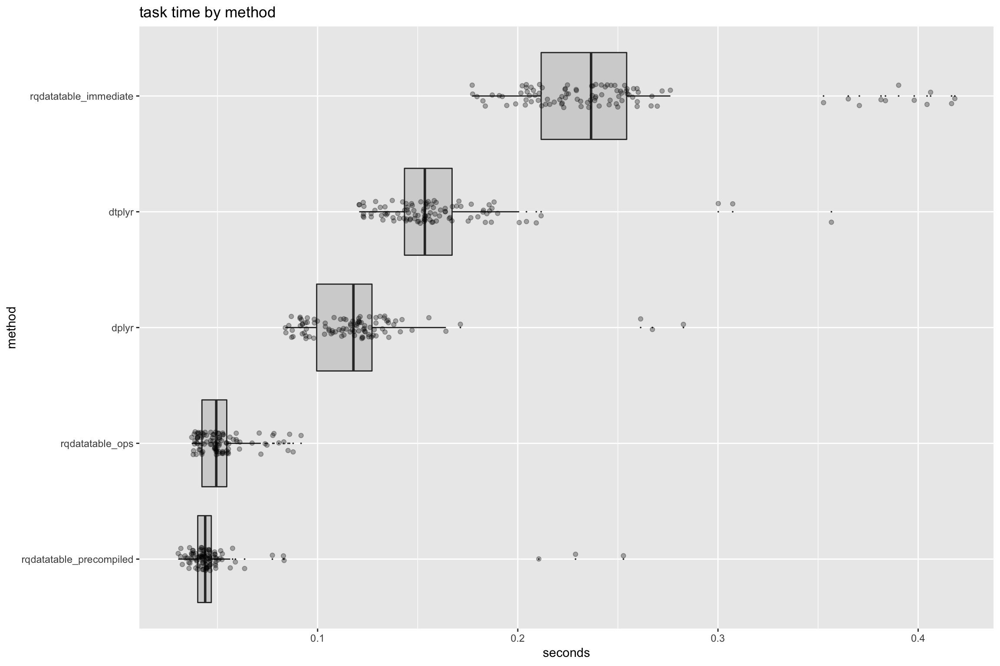
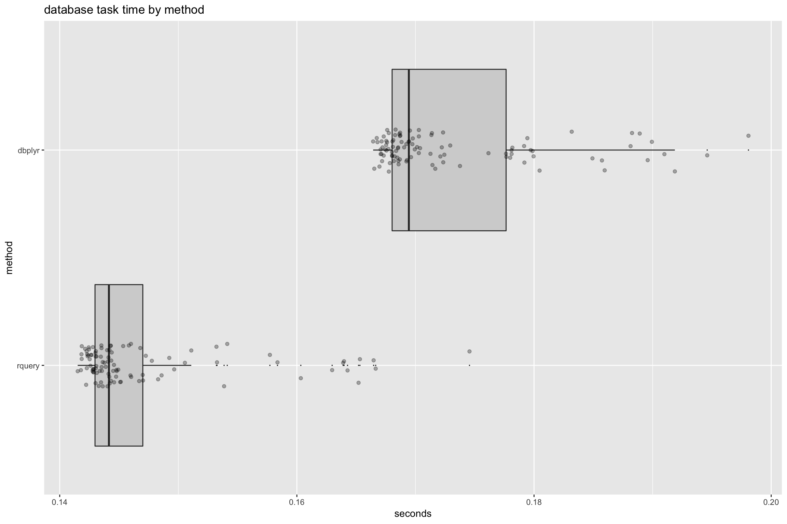

Immediate Issue
================

In this note we will explain [`rqdatatable`](https://CRAN.R-project.org/package=rqdatatable) immediate mode. We will also explain why one should still consider building explicit operator trees as a best practice in [`rqdatatable`](https://CRAN.R-project.org/package=rqdatatable)/[`rquery`](https://CRAN.R-project.org/package=rquery).

We are going to show some timings on small data. It has often been pointed out to not tune things on sub-second timings (as there is little point optimizing what is already fast and small examples may not show the same bottle necks as large examples). However, we have confirmed the `rqdatatabl` in-memory issue scales with data (so is an actual problem) and the remaining timings are consistent with what we have already shared on larger (more expensive) examples.

``` r
library("dplyr")
```

    ## Warning: package 'dplyr' was built under R version 3.5.1

    ## 
    ## Attaching package: 'dplyr'

    ## The following objects are masked from 'package:stats':
    ## 
    ##     filter, lag

    ## The following objects are masked from 'package:base':
    ## 
    ##     intersect, setdiff, setequal, union

``` r
library("dbplyr")
```

    ## 
    ## Attaching package: 'dbplyr'

    ## The following objects are masked from 'package:dplyr':
    ## 
    ##     ident, sql

``` r
library("data.table")
```

    ## 
    ## Attaching package: 'data.table'

    ## The following objects are masked from 'package:dplyr':
    ## 
    ##     between, first, last

``` r
library("dtplyr")
library("microbenchmark")
library("WVPlots")
library("rqdatatable")
```

    ## Loading required package: rquery

``` r
flights <- nycflights13::flights
str(flights)
```

    ## Classes 'tbl_df', 'tbl' and 'data.frame':    336776 obs. of  19 variables:
    ##  $ year          : int  2013 2013 2013 2013 2013 2013 2013 2013 2013 2013 ...
    ##  $ month         : int  1 1 1 1 1 1 1 1 1 1 ...
    ##  $ day           : int  1 1 1 1 1 1 1 1 1 1 ...
    ##  $ dep_time      : int  517 533 542 544 554 554 555 557 557 558 ...
    ##  $ sched_dep_time: int  515 529 540 545 600 558 600 600 600 600 ...
    ##  $ dep_delay     : num  2 4 2 -1 -6 -4 -5 -3 -3 -2 ...
    ##  $ arr_time      : int  830 850 923 1004 812 740 913 709 838 753 ...
    ##  $ sched_arr_time: int  819 830 850 1022 837 728 854 723 846 745 ...
    ##  $ arr_delay     : num  11 20 33 -18 -25 12 19 -14 -8 8 ...
    ##  $ carrier       : chr  "UA" "UA" "AA" "B6" ...
    ##  $ flight        : int  1545 1714 1141 725 461 1696 507 5708 79 301 ...
    ##  $ tailnum       : chr  "N14228" "N24211" "N619AA" "N804JB" ...
    ##  $ origin        : chr  "EWR" "LGA" "JFK" "JFK" ...
    ##  $ dest          : chr  "IAH" "IAH" "MIA" "BQN" ...
    ##  $ air_time      : num  227 227 160 183 116 150 158 53 140 138 ...
    ##  $ distance      : num  1400 1416 1089 1576 762 ...
    ##  $ hour          : num  5 5 5 5 6 5 6 6 6 6 ...
    ##  $ minute        : num  15 29 40 45 0 58 0 0 0 0 ...
    ##  $ time_hour     : POSIXct, format: "2013-01-01 05:00:00" "2013-01-01 05:00:00" ...

``` r
flights_dt <- data.table::as.data.table(flights)

con <- DBI::dbConnect(RPostgreSQL::PostgreSQL(),
                      host = 'localhost',
                      port = 5432,
                      user = 'johnmount',
                      password = '')

dbopts <- rq_connection_tests(con)
db_info <- rquery_db_info(connection = con, 
                          is_dbi = TRUE,
                          connection_options = dbopts)
  
copy_to(con, flights, "flights",
  temporary = TRUE, 
  overwrite = TRUE,
  indexes = list(
    c("year", "month", "day"), 
    "carrier", 
    "tailnum",
    "dest"
  )
)

flights_db <- tbl(con, "flights")
```

In-memory examples
==================

Example adapted from <https://cran.r-project.org/web/packages/dbplyr/vignettes/dbplyr.html>.

[`dplyr`](https://CRAN.R-project.org/package=dplyr) example.

``` r
tailnum_delay_dplyr <- flights %>% 
  filter(!is.na(arr_delay)) %>%
  group_by(tailnum) %>%
  summarise(
    delay = mean(arr_delay),
    n = n()
  ) %>% 
  arrange(desc(delay)) %>%
  filter(n > 100) 

head(tailnum_delay_dplyr)
```

    ## # A tibble: 6 x 3
    ##   tailnum delay     n
    ##   <chr>   <dbl> <int>
    ## 1 N11119   30.3   137
    ## 2 N16919   29.9   231
    ## 3 N14998   27.9   218
    ## 4 N15910   27.6   265
    ## 5 N13123   26.0   113
    ## 6 N11192   25.9   149

[`dtplyr`](https://CRAN.R-project.org/package=dtplyr) example.

``` r
class(flights_dt)
```

    ## [1] "data.table" "data.frame"

``` r
tailnum_delay_dtplyr <- flights_dt %>% 
  filter(!is.na(arr_delay)) %>%
  group_by(tailnum) %>%
  summarise(
    delay = mean(arr_delay),
    n = n()
  ) %>% 
  arrange(desc(delay)) %>%
  filter(n > 100) 

class(tailnum_delay_dtplyr)
```

    ## [1] "tbl_dt"     "tbl"        "data.table" "data.frame"

``` r
head(tailnum_delay_dtplyr)
```

    ## Source: local data table [6 x 3]
    ## 
    ## # A tibble: 6 x 3
    ##   tailnum delay     n
    ##   <chr>   <dbl> <int>
    ## 1 N11119   30.3   137
    ## 2 N16919   29.9   231
    ## 3 N14998   27.9   218
    ## 4 N15910   27.6   265
    ## 5 N13123   26.0   113
    ## 6 N11192   25.9   149

[`rqdatatable`](https://CRAN.R-project.org/package=rqdatatable) example.

``` r
ops <- flights %.>%
  local_td %.>%
  select_rows_nse(., !is.na(arr_delay)) %.>%
  extend_nse(.,
             one = 1) %.>%
  project_nse(., 
              groupby = "tailnum",
              delay = mean(arr_delay),
              n = sum(one)) %.>%
  orderby(., cols = "delay", reverse = "delay") %.>%
  select_rows_nse(., n > 100)

tailnum_delay_rqdatatable <- flights %.>% ops

head(tailnum_delay_rqdatatable)
```

    ##    tailnum    delay   n
    ## 1:  N11119 30.30657 137
    ## 2:  N16919 29.88745 231
    ## 3:  N14998 27.92202 218
    ## 4:  N15910 27.61132 265
    ## 5:  N13123 25.97345 113
    ## 6:  N11192 25.85235 149

``` r
cat(format(ops))
```

    ## table(flights; 
    ##   year,
    ##   month,
    ##   day,
    ##   dep_time,
    ##   sched_dep_time,
    ##   dep_delay,
    ##   arr_time,
    ##   sched_arr_time,
    ##   arr_delay,
    ##   carrier,
    ##   flight,
    ##   tailnum,
    ##   origin,
    ##   dest,
    ##   air_time,
    ##   distance,
    ##   hour,
    ##   minute,
    ##   time_hour) %.>%
    ##  select_rows(.,
    ##    !(is.na(arr_delay))) %.>%
    ##  extend(.,
    ##   one := 1) %.>%
    ##  project(., delay := mean(arr_delay), n := sum(one),
    ##   g= tailnum) %.>%
    ##  orderby(., desc(delay)) %.>%
    ##  select_rows(.,
    ##    n > 100)

We will compare four ways of processing the flights data.

-   `dplyr` in-memory pipeline.
-   `rqdatatable_precompiled` using new data with an existing pipeline definition (the recommended way to use `rquery`/`rqdatatable`).
-   `rqdatatable_ops` building and then using an `rqdatatable` pipeline (also recommended).
-   `rqdatatable_immediate` a convenience method for using `rquery` operators directly on in-memory data, without taking the time to pre-define the operator pipeline. We will call this mode "immediate mode". The point is it is a user convenience- but it has some overhead.

``` r
timings <- microbenchmark(
  dplyr = nrow(
    flights %>% 
      filter(!is.na(arr_delay)) %>%
      group_by(tailnum) %>%
      summarise(
        delay = mean(arr_delay),
        n = n()
      ) %>% 
      arrange(desc(delay)) %>%
      filter(n > 100) 
  ),
  dtplyr = nrow(
    flights_dt %>% 
      filter(!is.na(arr_delay)) %>%
      group_by(tailnum) %>%
      summarise(
        delay = mean(arr_delay),
        n = n()
      ) %>% 
      arrange(desc(delay)) %>%
      filter(n > 100) 
  ),
  rqdatatable_precompiled = nrow(flights %.>% ops),
  rqdatatable_ops = nrow(
    {
      ops1 <- flights %.>%
        local_td %.>%
        select_rows_nse(., !is.na(arr_delay)) %.>%
        extend_nse(.,
                   one = 1) %.>%
        project_nse(., 
                    groupby = "tailnum",
                    delay = mean(arr_delay),
                    n = sum(one)) %.>%
        orderby(., cols = "delay", reverse = "delay") %.>%
        select_rows_nse(., n > 100)
      nrow(flights %.>% ops1)
    }
  ),
  rqdatatable_immediate = nrow(
    flights %.>%
      select_rows_nse(., !is.na(arr_delay)) %.>%
      extend_nse(.,
                 one = 1) %.>%
      project_nse(., 
                  groupby = "tailnum",
                  delay = mean(arr_delay),
                  n = sum(one)) %.>%
      orderby(., cols = "delay", reverse = "delay") %.>%
      select_rows_nse(., n > 100)
  )
)

timings <- as.data.frame(timings)
timings$seconds <- timings$time/10^9 
timings$method <- factor(timings$expr)
timings$method <- reorder(timings$method, timings$seconds)
WVPlots::ScatterBoxPlotH(timings,  "seconds", "method", "task time by method")
```



The issue with `rqdatatable_immediate` is that we are paying a extra overhead copying (possibly wide) intermediate tables to naively convert `data.table` reference semantics to more `R`-like value semantics. This copying is repeated at each stage and is without the traditional `rquery` column liveness optimizations. This is because standard user/package defined operators (such as `%.>%`) are left to right associative- so pipelines are executed left to right, so `rquery`/`rqdatatable` is operating in a fairly blind or degraded mode in this situation. Roughly: `rqdatatable` in immediate mode is myopic (only can see one stage at a time) and fighting to bridge the difference between `data.table` and expected `R` semantics, so there are costs.

Our advice is: use `rqdatatable` immediate only for convenience. Please get in the habit of building operator trees or pipelines with working with `rqdatatable`/`rquery`. `rquery` is designed assuming the operator tree or pipeline is an finished object *before* it is given any data. This is a good choice given `rquery`'s "database first" design principles. In normal `rquery` all operation sequences start with a "data description" and *not* with data (`local_td` builds a data description from local data). This is core to how `rquery` optimizes queries and minimizes copying and translation overhead. Immediate-mode is for ad-hoc work and is solely to save the user the small trouble of saving a pipeline definition (as in demonstrated in `rqdatatable_ops`).

`dplyr`, on the other hand, is an in-memory first design. We see it is optimized for in-memory operation. As is often discussed `dplyr` gets "query as whole" effects by lazy evaluation, however we feel `rquery`'s more explicit user facing management of operator trees is in fact the better choice for database work.

`dtplyr` currently has the same problem as immediate-mode `rqdatatable` (to a lesser extent, though in `dtplyr`'s case there is no way to pre-build the operator tree to avoid the overhead). This is seen both in the runtime above and in the following note quoted from <https://github.com/hadley/dtplyr/blob/master/README.md>:

> `dtplyr` will always be a bit slower than `data.table`, because it creates copies of objects rather than mutating in place (that's the `dplyr` philosophy). Currently, `dtplyr` is quite a lot slower than bare data.table because the methods aren't quite smart enough.

We emphasize the "smart enough" is likely meaning "tracking more state" (such as tracking object visibility to avoid copying) and probably not a pejorative.

Database examples
=================

``` r
tailnum_delay_dbplyr <- flights_db %>% 
  filter(!is.na(arr_delay)) %>%
  group_by(tailnum) %>%
  summarise(
    delay = mean(arr_delay, na.rm = TRUE),
    n = n()
  ) %>% 
  arrange(desc(delay)) %>%
  filter(n > 100) 

head(tailnum_delay_dbplyr)
```

    ## # Source:     lazy query [?? x 3]
    ## # Database:   postgres 10.4.0 [johnmount@localhost:5432/johnmount]
    ## # Ordered by: desc(delay)
    ##   tailnum delay     n
    ##   <chr>   <dbl> <dbl>
    ## 1 N11119   30.3   137
    ## 2 N16919   29.9   231
    ## 3 N14998   27.9   218
    ## 4 N15910   27.6   265
    ## 5 N13123   26.0   113
    ## 6 N11192   25.9   149

``` r
db_info %.>% 
  ops %.>%
  head(.)
```

    ##   tailnum    delay   n
    ## 1  N11119 30.30657 137
    ## 2  N16919 29.88745 231
    ## 3  N14998 27.92202 218
    ## 4  N15910 27.61132 265
    ## 5  N13123 25.97345 113
    ## 6  N11192 25.85235 149

``` r
timingsdb <- microbenchmark(
  dbplyr = flights_db %>%
    filter(!is.na(arr_delay)) %>%
    group_by(tailnum) %>%
    summarise(
      delay = mean(arr_delay, na.rm = TRUE),
      n = n()
    ) %>%
    arrange(desc(delay)) %>%
    filter(n > 100) %>%
    collect(),
  rquery = db_info %.>% 
    ops 
)

timingsdb <- as.data.frame(timingsdb)
timingsdb$seconds <- timingsdb$time/10^9 
timingsdb$method <- factor(timingsdb$expr)
timingsdb$method <- reorder(timingsdb$method, timingsdb$seconds)
WVPlots::ScatterBoxPlotH(timingsdb,  "seconds", "method", "database task time by method")
```



``` r
DBI::dbDisconnect(con)
```

    ## [1] TRUE
