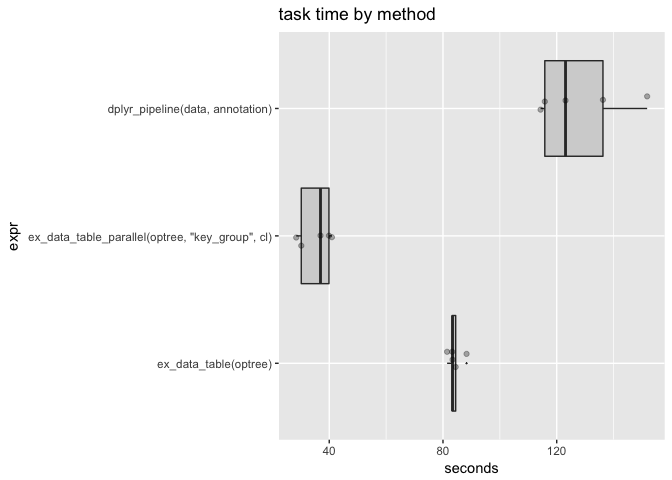

Parallel rqdatatable
================
John Mount
2018-06-09

One can try to execute `relop` trees in parallel. However, in unless the pipeline is very expensive the overhead of partitioning and distributing the work will by far overwhelm any parallel speedup. Also `data.table` itself already seems to exploit some thread-level parallelism (notice user time &gt; elapsed time).

``` r
have_parallel <- requireNamespace("parallel", quietly = TRUE)
```

``` r
library("rqdatatable")
```

    ## Loading required package: rquery

``` r
library("microbenchmark")
library("WVPlots")

cl <- parallel::makeCluster(4)
#parallel::clusterEvalQ(cl, library("rquery"))
#parallel::clusterEvalQ(cl, library("rqdatatable"))

set.seed(2362)
mk_example <- function(nkey, nrep, ngroup = 20) {
  keys <- paste0("key_", seq_len(nkey))
  key_group <- sample(as.character(seq_len(ngroup)), 
                      length(keys), replace = TRUE)
  names(key_group) <- keys
  key_table <- data.frame(
    key = rep(keys, nrep),
    stringsAsFactors = FALSE)
  key_table$data <- runif(nrow(key_table))
  instance_table <- data.frame(
    key = rep(keys, nrep),
    stringsAsFactors = FALSE)
  instance_table$id <- seq_len(nrow(instance_table))
  instance_table$info <- runif(nrow(instance_table))
  # groups should be no finer than keys
  key_table$key_group <- key_group[key_table$key]
  instance_table$key_group <- key_group[instance_table$key]
  list(key_table = key_table,
       instance_table = instance_table)
}

dlist <- mk_example(10, 5)
data <- dlist$instance_table
annotation <- dlist$key_table


# possible data lookup: find rows that
# have lookup data <= info
optree <- local_td(data) %.>%
  natural_join(., local_td(annotation), jointype = "INNER", by = "key") %.>%
  select_rows_nse(., data <= info) %.>%
  pick_top_k(., 
             k = 1,
             partitionby = "id",
             orderby = "data",
             reverse = "data",
             keep_order_column = FALSE) %.>%
  orderby(., "id")
cat(format(optree))
```

    ## table('data'; 
    ##   key,
    ##   id,
    ##   info,
    ##   key_group) %.>%
    ##  natural_join(.,
    ##   table('annotation'; 
    ##     key,
    ##     data,
    ##     key_group),
    ##   j= INNER, by= key) %.>%
    ##  select_rows(.,
    ##    data <= info) %.>%
    ##  extend(.,
    ##   row_rank := rank(),
    ##   p= id,
    ##   o= "data" DESC) %.>%
    ##  select_rows(.,
    ##    row_rank <= 1) %.>%
    ##  drop_columns(.,
    ##    row_rank) %.>%
    ##  orderby(., id)

``` r
res1 <- ex_data_table(optree)
head(res1)
```

    ##         data id      info   key key_group
    ## 1: 0.2252109  1 0.3300204 key_1        20
    ## 2: 0.6090348  2 0.6152025 key_2         8
    ## 3: 0.2804946  3 0.2931857 key_3        10
    ## 4: 0.4188050  4 0.7806856 key_4         5
    ## 5: 0.2710549  5 0.4483611 key_5        14
    ## 6: 0.5734857  7 0.6422148 key_7        20

``` r
nrow(res1)
```

    ## [1] 38

``` r
res2 <- ex_data_table_parallel(optree, "key_group", cl)
head(res2)
```

    ##         data id      info   key key_group
    ## 1: 0.2252109  1 0.3300204 key_1        20
    ## 2: 0.6090348  2 0.6152025 key_2         8
    ## 3: 0.2804946  3 0.2931857 key_3        10
    ## 4: 0.4188050  4 0.7806856 key_4         5
    ## 5: 0.2710549  5 0.4483611 key_5        14
    ## 6: 0.5734857  7 0.6422148 key_7        20

``` r
nrow(res2)
```

    ## [1] 38

``` r
dlist <- mk_example(100, 1000)
data <- dlist$instance_table
annotation <- dlist$key_table

timings <- microbenchmark(
  ex_data_table(optree),
  ex_data_table_parallel(optree, "key_group", cl),
  times = 5L)

print(timings)
```

    ## Unit: seconds
    ##                                             expr      min       lq
    ##                            ex_data_table(optree) 80.50610 90.11854
    ##  ex_data_table_parallel(optree, "key_group", cl) 27.37802 29.24340
    ##      mean   median        uq       max neval
    ##  93.77499 92.50298 101.68539 104.06193     5
    ##  31.69469 30.72369  34.06809  37.06025     5

``` r
timings <- as.data.frame(timings)
timings$seconds <- timings$time/1e+9
ScatterBoxPlotH(timings, xvar = "seconds", yvar = "expr", 
                title="task time by method")
```



``` r
parallel::stopCluster(cl)
rm(list = "cl")
```
