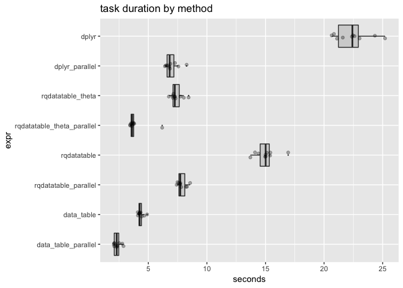
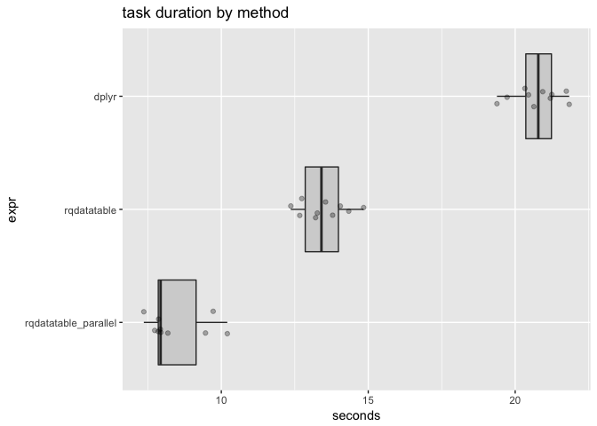

Parallel rqdatatable
================
John Mount
2018-06-11

One can try to execute [`rquery`](https://github.com/WinVector/rquery) `relop` trees in parallel using [`rqdatatable`](https://github.com/WinVector/rqdatatable). However, unless the pipeline is very expensive the overhead of partitioning and distributing the work will usually overwhelm any parallel speedup. Also `data.table` itself already seems to exploit some thread-level parallelism (notice user time &gt; elapsed time).

That being said, we can test an example where computation is expensive due to a blow-up in an intermediate join step.

Set up our execution environment and example (some details: OSX 10.13.4 on a 2.8 GHz Intel Core i5 Mac Mini (Late 2015 model) with 8GB ram and hybrid disk drive).

``` r
library("rqdatatable")
```

    ## Loading required package: rquery

``` r
library("microbenchmark")
library("ggplot2")
library("WVPlots")
library("dplyr")
```

    ## 
    ## Attaching package: 'dplyr'

    ## The following objects are masked from 'package:stats':
    ## 
    ##     filter, lag

    ## The following objects are masked from 'package:base':
    ## 
    ##     intersect, setdiff, setequal, union

``` r
base::date()
```

    ## [1] "Mon Jun 11 09:22:10 2018"

``` r
R.version.string
```

    ## [1] "R version 3.5.0 (2018-04-23)"

``` r
parallel::detectCores()
```

    ## [1] 4

``` r
packageVersion("parallel")
```

    ## [1] '3.5.0'

``` r
packageVersion("rqdatatable")
```

    ## [1] '0.1.0'

``` r
packageVersion("rquery")
```

    ## [1] '0.5.0'

``` r
packageVersion("dplyr")
```

    ## [1] '0.7.5'

``` r
cl <- parallel::makeCluster(4)
#parallel::clusterEvalQ(cl, library("rquery"))
#parallel::clusterEvalQ(cl, library("rqdatatable"))


set.seed(2362)
mk_example <- function(nkey, nrep, ngroup = 20) {
  keys <- paste0("key_", seq_len(nkey))
  key_group <- sample(as.character(seq_len(ngroup)), 
                      length(keys), replace = TRUE)
  names(key_group) <- keys
  key_table <- data.frame(
    key = rep(keys, nrep),
    stringsAsFactors = FALSE)
  key_table$data <- runif(nrow(key_table))
  instance_table <- data.frame(
    key = rep(keys, nrep),
    stringsAsFactors = FALSE)
  instance_table$id <- seq_len(nrow(instance_table))
  instance_table$info <- runif(nrow(instance_table))
  # groups should be no finer than keys
  key_table$key_group <- key_group[key_table$key]
  instance_table$key_group <- key_group[instance_table$key]
  list(key_table = key_table,
       instance_table = instance_table)
}

dlist <- mk_example(10, 10)
data <- dlist$instance_table
annotation <- dlist$key_table
```

[`rquery`](https://github.com/WinVector/rquery) and [`rqdatatable`](https://github.com/WinVector/rqdatatable) can operate a non-trivial operation tree as follows.

``` r
# possible data lookup: find rows that
# have lookup data <= info
optree <- local_td(data) %.>%
  natural_join(., local_td(annotation), jointype = "INNER", by = "key") %.>%
  select_rows_nse(., data <= info) %.>%
  pick_top_k(., 
             k = 1,
             partitionby = "id",
             orderby = "data",
             reverse = "data",
             keep_order_column = FALSE) %.>%
  orderby(., "id")
cat(format(optree))
```

    ## table('data'; 
    ##   key,
    ##   id,
    ##   info,
    ##   key_group) %.>%
    ##  natural_join(.,
    ##   table('annotation'; 
    ##     key,
    ##     data,
    ##     key_group),
    ##   j= INNER, by= key) %.>%
    ##  select_rows(.,
    ##    data <= info) %.>%
    ##  extend(.,
    ##   row_rank := rank(),
    ##   p= id,
    ##   o= "data" DESC) %.>%
    ##  select_rows(.,
    ##    row_rank <= 1) %.>%
    ##  drop_columns(.,
    ##    row_rank) %.>%
    ##  orderby(., id)

``` r
res1 <- ex_data_table(optree)
head(res1)
```

    ##         data id      info   key key_group
    ## 1: 0.9152014  1 0.9860654 key_1        20
    ## 2: 0.5599810  2 0.5857570 key_2         8
    ## 3: 0.3011882  3 0.3334490 key_3        10
    ## 4: 0.3650987  4 0.3960980 key_4         5
    ## 5: 0.1469254  5 0.1753649 key_5        14
    ## 6: 0.2567631  6 0.3510280 key_6         7

``` r
nrow(res1)
```

    ## [1] 94

And we can execute the operations in parallel.

``` r
parallel::clusterEvalQ(cl, library("rqdatatable"))
```

    ## [[1]]
    ## [1] "rqdatatable" "rquery"      "stats"       "graphics"    "grDevices"  
    ## [6] "utils"       "datasets"    "methods"     "base"       
    ## 
    ## [[2]]
    ## [1] "rqdatatable" "rquery"      "stats"       "graphics"    "grDevices"  
    ## [6] "utils"       "datasets"    "methods"     "base"       
    ## 
    ## [[3]]
    ## [1] "rqdatatable" "rquery"      "stats"       "graphics"    "grDevices"  
    ## [6] "utils"       "datasets"    "methods"     "base"       
    ## 
    ## [[4]]
    ## [1] "rqdatatable" "rquery"      "stats"       "graphics"    "grDevices"  
    ## [6] "utils"       "datasets"    "methods"     "base"

``` r
res2 <- ex_data_table_parallel(optree, "key_group", cl)
head(res2)
```

    ##         data id      info   key key_group
    ## 1: 0.9152014  1 0.9860654 key_1        20
    ## 2: 0.5599810  2 0.5857570 key_2         8
    ## 3: 0.3011882  3 0.3334490 key_3        10
    ## 4: 0.3650987  4 0.3960980 key_4         5
    ## 5: 0.1469254  5 0.1753649 key_5        14
    ## 6: 0.2567631  6 0.3510280 key_6         7

``` r
nrow(res2)
```

    ## [1] 94

[`data.table`](http://r-datatable.com) can implement the same function.

``` r
library("data.table")
```

    ## 
    ## Attaching package: 'data.table'

    ## The following objects are masked from 'package:dplyr':
    ## 
    ##     between, first, last

``` r
data_table_f <- function(data, annotation) {
  data <- data.table::as.data.table(data)
  annotation <- data.table::as.data.table(annotation)
  joined <- merge(data, annotation, by = "key", all=FALSE, allow.cartesian=TRUE)
  joined <- joined[joined$data <= joined$info, ]
  data.table::setorderv(joined, cols = "data")
  joined <- joined[, .SD[.N], id]
  data.table::setorderv(joined, cols = "id")
}
resdt <- data_table_f(data, annotation)
head(resdt)
```

    ##    id   key      info key_group.x      data key_group.y
    ## 1:  1 key_1 0.9860654          20 0.9152014          20
    ## 2:  2 key_2 0.5857570           8 0.5599810           8
    ## 3:  3 key_3 0.3334490          10 0.3011882          10
    ## 4:  4 key_4 0.3960980           5 0.3650987           5
    ## 5:  5 key_5 0.1753649          14 0.1469254          14
    ## 6:  6 key_6 0.3510280           7 0.2567631           7

``` r
nrow(resdt)
```

    ## [1] 94

We can also run `data.table` in parallel using [`wrapr::execute_parallel`](https://winvector.github.io/wrapr/reference/execute_parallel.html).

``` r
parallel::clusterEvalQ(cl, library("data.table"))
```

    ## [[1]]
    ##  [1] "data.table"  "rqdatatable" "rquery"      "stats"       "graphics"   
    ##  [6] "grDevices"   "utils"       "datasets"    "methods"     "base"       
    ## 
    ## [[2]]
    ##  [1] "data.table"  "rqdatatable" "rquery"      "stats"       "graphics"   
    ##  [6] "grDevices"   "utils"       "datasets"    "methods"     "base"       
    ## 
    ## [[3]]
    ##  [1] "data.table"  "rqdatatable" "rquery"      "stats"       "graphics"   
    ##  [6] "grDevices"   "utils"       "datasets"    "methods"     "base"       
    ## 
    ## [[4]]
    ##  [1] "data.table"  "rqdatatable" "rquery"      "stats"       "graphics"   
    ##  [6] "grDevices"   "utils"       "datasets"    "methods"     "base"

``` r
parallel::clusterExport(cl, "data_table_f")

dt_f <- function(tables_list) {
  data <- tables_list$data
  annotation <- tables_list$annotation
  data_table_f(data, annotation)
}

data_table_parallel_f <- function(data, annotation) {
  respdt <- wrapr::execute_parallel(tables = list(data = data, annotation = annotation),
                                  f = dt_f,
                                  partition_column = "key_group",
                                  cl = cl) %.>%
  data.table::rbindlist(.)
  data.table::setorderv(respdt, cols = "id")
  respdt
}
respdt <- data_table_parallel_f(data, annotation)
head(respdt)
```

    ##    id   key      info key_group.x      data key_group.y
    ## 1:  1 key_1 0.9860654          20 0.9152014          20
    ## 2:  2 key_2 0.5857570           8 0.5599810           8
    ## 3:  3 key_3 0.3334490          10 0.3011882          10
    ## 4:  4 key_4 0.3960980           5 0.3650987           5
    ## 5:  5 key_5 0.1753649          14 0.1469254          14
    ## 6:  6 key_6 0.3510280           7 0.2567631           7

``` r
nrow(respdt)
```

    ## [1] 94

[`dplyr`](https://CRAN.R-project.org/package=dplyr) can also implement the solution.

``` r
dplyr_pipeline <- function(data, annotation) {
  res <- data %>%
    inner_join(annotation, by = "key") %>%
    filter(data <= info) %>%
    group_by(id) %>%
    arrange(-data) %>%
    mutate(rownum = row_number()) %>%
    ungroup() %>%
    filter(rownum == 1) %>%
    arrange(id)
  res
}

resd <- dplyr_pipeline(data, annotation)
head(resd)
```

    ## # A tibble: 6 x 7
    ##   key      id  info key_group.x  data key_group.y rownum
    ##   <chr> <int> <dbl> <chr>       <dbl> <chr>        <int>
    ## 1 key_1     1 0.986 20          0.915 20               1
    ## 2 key_2     2 0.586 8           0.560 8                1
    ## 3 key_3     3 0.333 10          0.301 10               1
    ## 4 key_4     4 0.396 5           0.365 5                1
    ## 5 key_5     5 0.175 14          0.147 14               1
    ## 6 key_6     6 0.351 7           0.257 7                1

``` r
nrow(resd)
```

    ## [1] 94

And we can use [`wrapr::execute_parallel`](https://winvector.github.io/wrapr/reference/execute_parallel.html) to also parallelize the `dplyr` solution.

``` r
parallel::clusterEvalQ(cl, library("dplyr"))
```

    ## [[1]]
    ##  [1] "dplyr"       "data.table"  "rqdatatable" "rquery"      "stats"      
    ##  [6] "graphics"    "grDevices"   "utils"       "datasets"    "methods"    
    ## [11] "base"       
    ## 
    ## [[2]]
    ##  [1] "dplyr"       "data.table"  "rqdatatable" "rquery"      "stats"      
    ##  [6] "graphics"    "grDevices"   "utils"       "datasets"    "methods"    
    ## [11] "base"       
    ## 
    ## [[3]]
    ##  [1] "dplyr"       "data.table"  "rqdatatable" "rquery"      "stats"      
    ##  [6] "graphics"    "grDevices"   "utils"       "datasets"    "methods"    
    ## [11] "base"       
    ## 
    ## [[4]]
    ##  [1] "dplyr"       "data.table"  "rqdatatable" "rquery"      "stats"      
    ##  [6] "graphics"    "grDevices"   "utils"       "datasets"    "methods"    
    ## [11] "base"

``` r
parallel::clusterExport(cl, "dplyr_pipeline")

dplyr_f <- function(tables_list) {
  data <- tables_list$data
  annotation <- tables_list$annotation
  dplyr_pipeline(data, annotation)
}

dplyr_parallel_f <- function(data, annotation) {
  respdt <- wrapr::execute_parallel(tables = list(data = data, annotation = annotation),
                                  f = dplyr_f,
                                  partition_column = "key_group",
                                  cl = cl) %>%
    dplyr::bind_rows() %>%
    arrange(id)
}
respdplyr <- dplyr_parallel_f(data, annotation)
head(respdplyr)
```

    ## # A tibble: 6 x 7
    ##   key      id  info key_group.x  data key_group.y rownum
    ##   <chr> <int> <dbl> <chr>       <dbl> <chr>        <int>
    ## 1 key_1     1 0.986 20          0.915 20               1
    ## 2 key_2     2 0.586 8           0.560 8                1
    ## 3 key_3     3 0.333 10          0.301 10               1
    ## 4 key_4     4 0.396 5           0.365 5                1
    ## 5 key_5     5 0.175 14          0.147 14               1
    ## 6 key_6     6 0.351 7           0.257 7                1

``` r
nrow(respdplyr)
```

    ## [1] 94

We can time the various realizations.

``` r
dlist <- mk_example(300, 300)
data <- dlist$instance_table
annotation <- dlist$key_table

timings <- microbenchmark(
  data_table_parallel = nrow(data_table_parallel_f(data, annotation)),
  data_table = nrow(data_table_f(data, annotation)),
  rqdatatable_parallel = nrow(ex_data_table_parallel(optree, "key_group", cl)),
  rqdatatable = nrow(ex_data_table(optree)),
  dplyr_parallel = nrow(dplyr_parallel_f(data, annotation)),
  dplyr = nrow(dplyr_pipeline(data, annotation)),
  times = 10L)

saveRDS(timings, "Parallel_rqdatatable_timings.RDS")
```

``` r
print(timings)
```

    ## Unit: seconds
    ##                  expr       min        lq      mean    median        uq
    ##   data_table_parallel  5.349467  5.429295  6.185279  6.287543  6.656685
    ##            data_table 10.113425 10.775918 10.974409 10.889765 11.023422
    ##  rqdatatable_parallel  7.547536  7.622098  8.038160  7.944890  8.381770
    ##           rqdatatable 13.043852 14.565800 15.133214 15.071887 16.255095
    ##        dplyr_parallel  6.322625  7.195685  7.950209  7.814357  8.338782
    ##                 dplyr 20.551616 21.055260 22.575246 21.759043 24.314034
    ##        max neval
    ##   7.393918    10
    ##  12.947765    10
    ##   8.787670    10
    ##  16.666136    10
    ##  10.018203    10
    ##  27.188850    10

``` r
autoplot(timings)
```



``` r
timings <- as.data.frame(timings)
timings$seconds <- timings$time/1e+9

ScatterBoxPlotH(timings, 
                xvar = "seconds", yvar = "expr", 
                title="task duration by method")
```



[`multidplyr`](https://github.com/hadley/multidplyr) does not appear to work on this example, so we could not include it in the timings.

``` r
library("multidplyr") # https://github.com/hadley/multidplyr
packageVersion("multidplyr")
```

    ## [1] '0.0.0.9000'

``` r
multidplyr::set_default_cluster(cl)

# example similar to https://github.com/hadley/multidplyr/blob/master/vignettes/multidplyr.Rmd
class(data)
```

    ## [1] "data.frame"

``` r
datap <- multidplyr::partition(data, key_group)
```

    ## Warning: group_indices_.grouped_df ignores extra arguments

``` r
head(datap)
```

    ## # A tibble: 6 x 4
    ## # Groups:   key_group [3]
    ##   key       id   info key_group
    ##   <chr>  <int>  <dbl> <chr>    
    ## 1 key_3      3 0.0284 15       
    ## 2 key_5      5 0.838  15       
    ## 3 key_9      9 0.888  2        
    ## 4 key_10    10 0.983  7        
    ## 5 key_15    15 0.988  2        
    ## 6 key_19    19 0.691  2

``` r
class(datap)
```

    ## [1] "party_df"

``` r
class(annotation)
```

    ## [1] "data.frame"

``` r
annotationp <- multidplyr::partition(annotation, key_group)
```

    ## Warning: group_indices_.grouped_df ignores extra arguments

``` r
head(annotationp)
```

    ## # A tibble: 6 x 3
    ## # Groups:   key_group [3]
    ##   key     data key_group
    ##   <chr>  <dbl> <chr>    
    ## 1 key_1  0.481 6        
    ## 2 key_9  0.490 2        
    ## 3 key_11 0.348 14       
    ## 4 key_15 0.325 2        
    ## 5 key_18 0.476 14       
    ## 6 key_19 0.934 2

``` r
class(annotationp)
```

    ## [1] "party_df"

``` r
dplyr_pipeline(datap, annotationp) %>%
  collect()
```

    ## Error in UseMethod("inner_join"): no applicable method for 'inner_join' applied to an object of class "party_df"

[`dtplyr`](https://CRAN.R-project.org/package=dtplyr) does not appear to work on this example, so we could not include it in the timings.

``` r
library("data.table")
library("dtplyr") #  https://CRAN.R-project.org/package=dtplyr
packageVersion("data.table")
```

    ## [1] '1.11.4'

``` r
packageVersion("dtplyr")
```

    ## [1] '0.0.2'

``` r
class(data)
```

    ## [1] "data.frame"

``` r
datadt <- data.table::as.data.table(data)
head(datadt)
```

    ##      key id       info key_group
    ## 1: key_1  1 0.19866525         6
    ## 2: key_2  2 0.84333232        19
    ## 3: key_3  3 0.02837453        15
    ## 4: key_4  4 0.87365445        13
    ## 5: key_5  5 0.83771302        15
    ## 6: key_6  6 0.02838293        12

``` r
class(datadt)
```

    ## [1] "data.table" "data.frame"

``` r
class(annotation)
```

    ## [1] "data.frame"

``` r
annotationdt <- data.table::as.data.table(annotation)
head(annotationdt)
```

    ##      key      data key_group
    ## 1: key_1 0.4810728         6
    ## 2: key_2 0.4595057        19
    ## 3: key_3 0.1476172        15
    ## 4: key_4 0.5624729        13
    ## 5: key_5 0.1921203        15
    ## 6: key_6 0.8842115        12

``` r
class(annotationdt)
```

    ## [1] "data.table" "data.frame"

``` r
dplyr_pipeline(datadt, annotationdt)
```

    ## Error in data.table::is.data.table(data): argument "x" is missing, with no default

My theory is `dplyr` is seeing better scaling to processors because `dplyr` appears to be purely single threaded and `data.table` is multi-threaded (see for example `help("setDTthreads")`). `rqdatatable`'s performance regression relative to `datatable` I believe is from `rqdatatable`'s ranking strategy (something we will likely tune later, already [sometimes `rqdatatable` is competitive with `data.table` and actually quite fast](https://github.com/WinVector/rquery/blob/master/extras/data_table_replot.md)).


``` r
parallel::stopCluster(cl)
rm(list = "cl")
```
