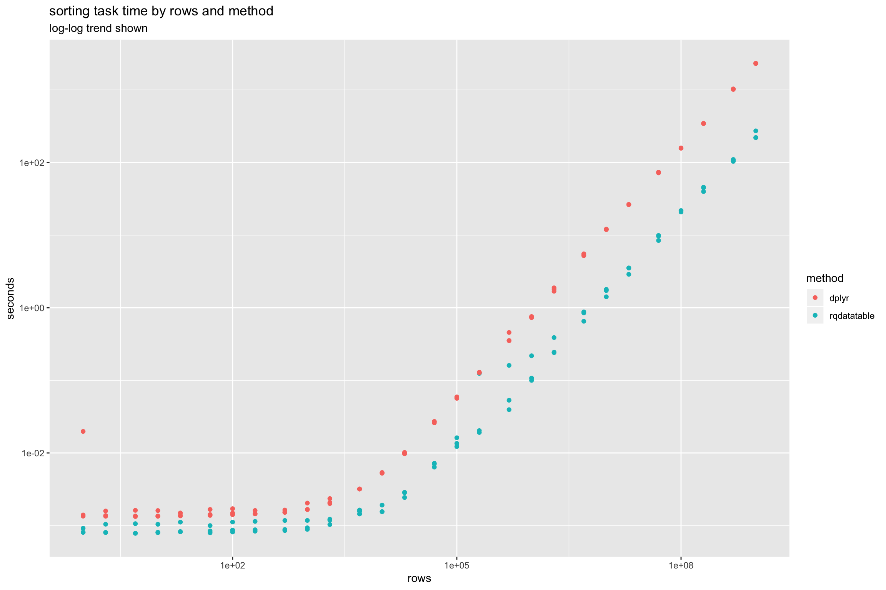
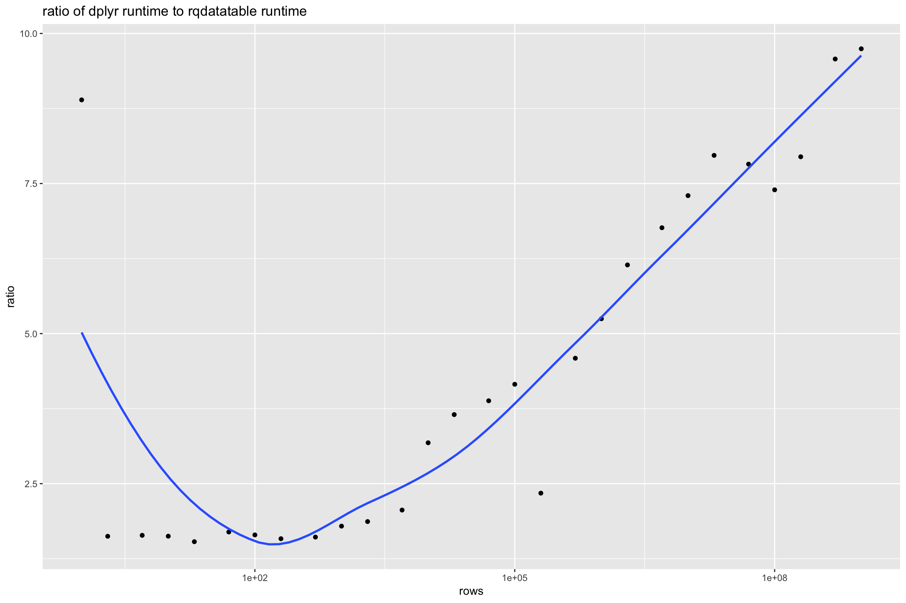
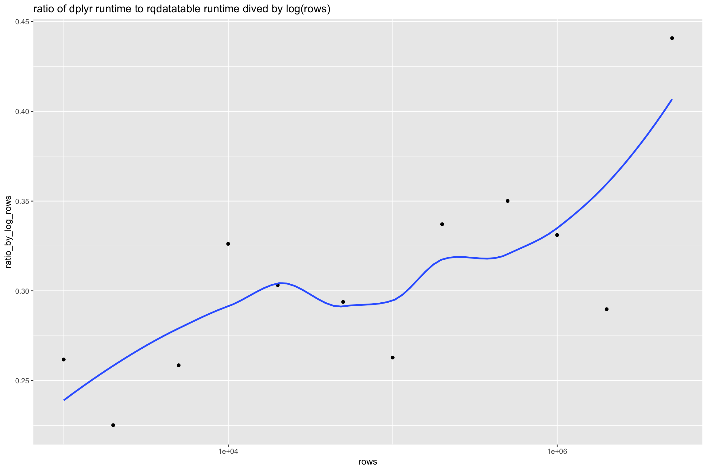

Sorting
================

Amazon EC2 `r4.8xlarge`.

``` r
library("rqdatatable")
```

    ## Loading required package: rquery

``` r
library("microbenchmark")
library("ggplot2")
library("WVPlots")
library("cdata")
library("dplyr")
```

    ## Warning: package 'dplyr' was built under R version 3.5.1

    ## 
    ## Attaching package: 'dplyr'

    ## The following objects are masked from 'package:stats':
    ## 
    ##     filter, lag

    ## The following objects are masked from 'package:base':
    ## 
    ##     intersect, setdiff, setequal, union

``` r
packageVersion("dplyr")
```

    ## [1] '0.7.6'

``` r
R.version
```

    ##                _                           
    ## platform       x86_64-apple-darwin15.6.0   
    ## arch           x86_64                      
    ## os             darwin15.6.0                
    ## system         x86_64, darwin15.6.0        
    ## status                                     
    ## major          3                           
    ## minor          5.0                         
    ## year           2018                        
    ## month          04                          
    ## day            23                          
    ## svn rev        74626                       
    ## language       R                           
    ## version.string R version 3.5.0 (2018-04-23)
    ## nickname       Joy in Playing

``` r
set.seed(32523)

mk_data <- function(nrow) {
  data.frame(col_a = sample(letters, nrow, replace=TRUE),
             col_b = sample(letters, nrow, replace=TRUE),
             col_c = sample(letters, nrow, replace=TRUE),
             col_x = runif(nrow),
             stringsAsFactors = FALSE)
}
```

``` r
ops <- mk_td("d", c("col_a", "col_b", "col_c", "col_x")) %.>%
  orderby(., cols = c("col_a", "col_b", "col_c", "col_x"))

# from help(microbenchmark)
my_check <- function(values) {
  all(sapply(values[-1], function(x) identical(values[[1]], x)))
}

if(!file.exists("Sorting_runs.RDS")) {
  szs <- expand.grid(a = c(1,2,5), b = 10^{0:9})
  szs <- sort(unique(szs$a * szs$b))
  szs <- szs[szs<=1e+9]
  runs <- lapply(
    szs,
    function(sz) {
      d <- mk_data(sz)
      ti <- microbenchmark(
        rqdatatable = { d %.>% ops %.>% as.data.frame(.) },
        dplyr = dplyr::arrange(d, col_a, col_b, col_c, col_x),
        times = 3L,
        check = my_check)
      ti <- as.data.frame(ti)
      ti$rows <- sz
      ti
    })
  saveRDS(runs, "Sorting_runs.RDS")
} else {
  runs <- readRDS("Sorting_runs.RDS")
}
```

``` r
timings <- do.call(rbind, runs)
timings$seconds <- timings$time/1e+9
timings$method <- factor(timings$expr)
timings$method <- reorder(timings$method, -timings$seconds)

ggplot(data = timings, aes(x = rows, y = seconds, color = method)) +
  geom_point() + 
  scale_x_log10() + scale_y_log10() +
  ggtitle("sorting task time by rows and method",
          subtitle = "log-log trend shown")
```



``` r
means <- timings %.>%
  project_nse(., 
              groupby = c("method", "rows"), 
              seconds = mean(seconds)) %.>%
  pivot_to_rowrecs(., 
                   columnToTakeKeysFrom = "method",
                   columnToTakeValuesFrom = "seconds",
                   rowKeyColumns = "rows") %.>%
  extend_nse(., 
             ratio = dplyr/rqdatatable,
             ratio_by_log_rows = ratio/log(rows)) %.>%
  orderby(., "rows")

means[]
```

    ##      rows        dplyr  rqdatatable    ratio ratio_by_log_rows
    ##  1: 1e+00 7.512546e-03 8.447120e-04 8.893619               Inf
    ##  2: 2e+00 1.433092e-03 8.825917e-04 1.623732         2.3425501
    ##  3: 5e+00 1.433712e-03 8.745453e-04 1.639380         1.0186042
    ##  4: 1e+01 1.433365e-03 8.820627e-04 1.625015         0.7057349
    ##  5: 2e+01 1.409028e-03 9.188653e-04 1.533443         0.5118759
    ##  6: 5e+01 1.487101e-03 8.773003e-04 1.695088         0.4333021
    ##  7: 1e+02 1.534252e-03 9.320023e-04 1.646189         0.3574653
    ##  8: 2e+02 1.503371e-03 9.496900e-04 1.583013         0.2987765
    ##  9: 5e+02 1.560781e-03 9.694797e-04 1.609917         0.2590536
    ## 10: 1e+03 1.787874e-03 9.974180e-04 1.792502         0.2594912
    ## 11: 2e+03 2.142200e-03 1.146349e-03 1.868716         0.2458545
    ## 12: 5e+03 3.185595e-03 1.546178e-03 2.060303         0.2418993
    ## 13: 1e+04 5.318234e-03 1.671695e-03 3.181343         0.3454099
    ## 14: 2e+04 9.901867e-03 2.712320e-03 3.650700         0.3686278
    ## 15: 5e+04 2.666478e-02 6.870682e-03 3.880951         0.3586904
    ## 16: 1e+05 5.809478e-02 1.397901e-02 4.155857         0.3609731
    ## 17: 2e+05 1.280969e-01 5.469403e-02 2.342063         0.1918769
    ## 18: 5e+05 3.875499e-01 8.443959e-02 4.589670         0.3497594
    ## 19: 1e+06 7.440808e-01 1.417959e-01 5.247547         0.3798301
    ## 20: 2e+06 1.788703e+00 2.911317e-01 6.143964         0.4234688
    ## 21: 5e+06 5.359406e+00 7.923789e-01 6.763691         0.4384903
    ## 22: 1e+07 1.200489e+01 1.644831e+00 7.298557         0.4528176
    ## 23: 2e+07 2.642376e+01 3.315858e+00 7.968906         0.4740224
    ## 24: 5e+07 7.308476e+01 9.342235e+00 7.823049         0.4412937
    ## 25: 1e+08 1.582278e+02 2.139545e+01 7.395392         0.4014722
    ## 26: 2e+08 3.457414e+02 4.351161e+01 7.945957         0.4157177
    ## 27: 5e+08 1.026914e+03 1.072533e+02 9.574662         0.4780132
    ## 28: 1e+09 2.323070e+03 2.383930e+02 9.744707         0.4702303
    ##      rows        dplyr  rqdatatable    ratio ratio_by_log_rows

``` r
ggplot(data = means, aes(x = rows, y = ratio)) +
  geom_point() + 
  geom_smooth(se = FALSE) +
  scale_x_log10() + 
  ggtitle("ratio of dplyr runtime to rqdatatable runtime")
```

    ## `geom_smooth()` using method = 'loess' and formula 'y ~ x'



``` r
ggplot(data = means, aes(x = rows, y = ratio_by_log_rows)) +
  geom_point() + 
  geom_smooth(se = FALSE) +
  scale_x_log10() + 
  ggtitle("ratio of dplyr runtime to rqdatatable runtime dived by log(rows)")
```

    ## `geom_smooth()` using method = 'loess' and formula 'y ~ x'

    ## Warning: Removed 1 rows containing non-finite values (stat_smooth).


