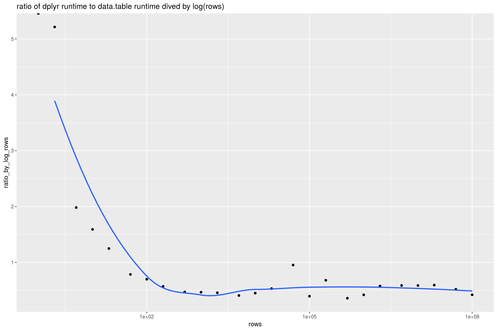

Sorting
================

Amazon EC2 `r4.8xlarge` (244 GiB RAM) run (8-12-2018, 64-bit Ubuntu Server 16.04 LTS (HVM), SSD Volume Type - ami-ba602bc2, R 3.4.4 all packages current).

``` r
library("rqdatatable")
```

    ## Loading required package: rquery

``` r
library("microbenchmark")
library("ggplot2")
library("WVPlots")
library("cdata")
library("dplyr")
```

    ## 
    ## Attaching package: 'dplyr'

    ## The following objects are masked from 'package:stats':
    ## 
    ##     filter, lag

    ## The following objects are masked from 'package:base':
    ## 
    ##     intersect, setdiff, setequal, union

``` r
library("data.table")
```

    ## 
    ## Attaching package: 'data.table'

    ## The following objects are masked from 'package:dplyr':
    ## 
    ##     between, first, last

``` r
set.seed(32523)

mk_data <- function(nrow) {
  data.frame(col_a = sample(letters, nrow, replace=TRUE),
             col_b = sample(letters, nrow, replace=TRUE),
             col_c = sample(letters, nrow, replace=TRUE),
             col_x = runif(nrow),
             stringsAsFactors = FALSE)
}
```

``` r
ops <- mk_td("d", c("col_a", "col_b", "col_c", "col_x")) %.>%
  orderby(., cols = c("col_a", "col_b", "col_c", "col_x"))

# from help(microbenchmark)
my_check <- function(values) {
  all(sapply(values[-1], function(x) identical(values[[1]], x)))
}
```

``` r
rds_file <- "Sorting_runs.RDS"
if(!file.exists(rds_file)) {
  pow <- 8
  szs <- expand.grid(a = c(1,2,5), b = 10^{0:pow})
  szs <- sort(unique(szs$a * szs$b))
  szs <- szs[szs<=10^pow]
  runs <- lapply(
    szs,
    function(sz) {
      d <- mk_data(sz)
      ti <- microbenchmark(
        data.table = {
          d %.>%
            as.data.table(.) %.>% 
            setorder(., col_a, col_b, col_c, col_x) %.>%
            setDF(.)[] 
        },
        rqdatatable = { 
          d %.>% 
            ops %.>% 
            as.data.frame(.) 
        },
        dplyr = {
          dplyr::arrange(d, col_a, col_b, col_c, col_x)
        },
        times = 3L,
        check = my_check)
      ti <- as.data.frame(ti)
      ti$rows <- sz
      ti
    })
  saveRDS(runs, rds_file)
} else {
  runs <- readRDS(rds_file)
}
```

``` r
timings <- do.call(rbind, runs)
timings$seconds <- timings$time/1e+9
timings$method <- factor(timings$expr)
timings$method <- reorder(timings$method, -timings$seconds)

ggplot(data = timings, 
       aes(x = rows, y = seconds, color = method)) +
  geom_point() + 
  geom_smooth(se = FALSE) +
  scale_x_log10() + scale_y_log10() +
  ggtitle("sorting task time by rows and method",
          subtitle = "log-log trend shown")
```

    ## `geom_smooth()` using method = 'loess' and formula 'y ~ x'


``` r
ggplot(data = timings[timings$method!="rqdatatable", , drop = FALSE], 
       aes(x = rows, y = seconds, color = method)) +
  geom_point() + 
  geom_smooth(se = FALSE) +
  scale_x_log10() + scale_y_log10() +
  ggtitle("sorting task time by rows and method",
          subtitle = "log-log trend shown")
```

    ## `geom_smooth()` using method = 'loess' and formula 'y ~ x'


``` r
means <- timings %.>%
  project_nse(., 
              groupby = c("method", "rows"), 
              seconds = mean(seconds)) %.>%
  pivot_to_rowrecs(., 
                   columnToTakeKeysFrom = "method",
                   columnToTakeValuesFrom = "seconds",
                   rowKeyColumns = "rows") %.>%
  extend_nse(., 
             ratio = dplyr/data.table,
             ratio_by_log_rows = ratio/log(rows)) %.>%
  orderby(., "rows") %.>%
  as.data.frame(.)

knitr::kable(means)
```

|   rows|  data.table|        dplyr|  rqdatatable|      ratio|  ratio\_by\_log\_rows|
|------:|-----------:|------------:|------------:|----------:|---------------------:|
|  1e+00|   0.0004077|    0.0076316|    0.0008804|  18.719959|                   Inf|
|  2e+00|   0.0004035|    0.0014585|    0.0008818|   3.614217|             5.2142136|
|  5e+00|   0.0004741|    0.0015127|    0.0008543|   3.190409|             1.9823126|
|  1e+01|   0.0004051|    0.0014841|    0.0008885|   3.663244|             1.5909266|
|  2e+01|   0.0004001|    0.0014963|    0.0008898|   3.739903|             1.2484104|
|  5e+01|   0.0004791|    0.0014716|    0.0008554|   3.071596|             0.7851683|
|  1e+02|   0.0004747|    0.0015271|    0.0008471|   3.216743|             0.6985069|
|  2e+02|   0.0004983|    0.0015067|    0.0008857|   3.023557|             0.5706636|
|  5e+02|   0.0005444|    0.0015958|    0.0009128|   2.931345|             0.4716862|
|  1e+03|   0.0005576|    0.0017957|    0.0009517|   3.220292|             0.4661850|
|  2e+03|   0.0006078|    0.0021119|    0.0011654|   3.474785|             0.4571543|
|  5e+03|   0.0009465|    0.0032869|    0.0014573|   3.472520|             0.4077071|
|  1e+04|   0.0012682|    0.0052561|    0.0016782|   4.144441|             0.4499770|
|  2e+04|   0.0019908|    0.0104596|    0.0025562|   5.254009|             0.5305210|
|  5e+04|   0.0057635|    0.0594585|    0.0068824|  10.316401|             0.9534761|
|  1e+05|   0.0128816|    0.0584981|    0.0135057|   4.541204|             0.3944440|
|  2e+05|   0.0155656|    0.1291835|    0.0558137|   8.299297|             0.6799318|
|  5e+05|   0.0740364|    0.3483736|    0.0521505|   4.705438|             0.3585816|
|  1e+06|   0.1285398|    0.7447626|    0.1051548|   5.794021|             0.4193852|
|  2e+06|   0.2023114|    1.6917564|    0.2341636|   8.362141|             0.5763552|
|  5e+06|   0.5872843|    5.3194821|    0.7157426|   9.057763|             0.5872151|
|  1e+07|   1.2644908|   11.9558664|    1.6543575|   9.455084|             0.5866129|
|  2e+07|   2.6836465|   26.7849712|    3.2131316|   9.980812|             0.5936986|
|  5e+07|   7.9980163|   73.4681060|    8.4911241|   9.185791|             0.5181652|
|  1e+08|  20.2643089|  156.8686366|   21.8431452|   7.741129|             0.4202412|

``` r
ggplot(data = means, 
       aes(x = rows, y = ratio)) +
  geom_point() + 
  geom_smooth(se = FALSE) +
  scale_x_log10() + 
  ggtitle("ratio of dplyr runtime to data.table runtime")
```

    ## `geom_smooth()` using method = 'loess' and formula 'y ~ x'


``` r
ggplot(data = means, 
       aes(x = rows, y = ratio_by_log_rows)) +
  geom_point() + 
  geom_smooth(se = FALSE) +
  scale_x_log10() + 
  ggtitle("ratio of dplyr runtime to data.table runtime dived by log(rows)")
```

    ## `geom_smooth()` using method = 'loess' and formula 'y ~ x'

    ## Warning: Removed 1 rows containing non-finite values (stat_smooth).


