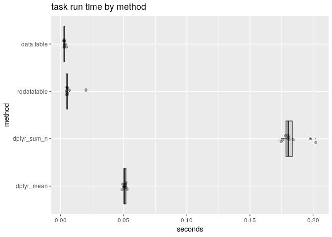
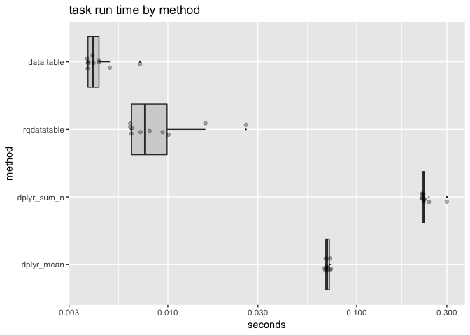
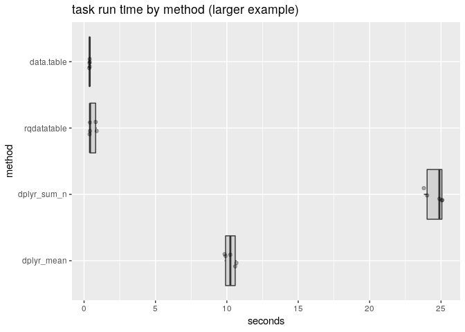
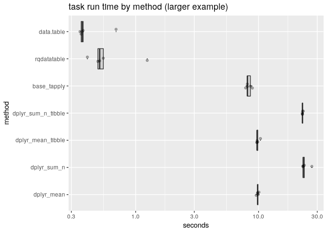

Timing Grouped Mean
================

This note is a comment on some of the timings shared in the dplyr-0.8.0 [pre-release announcement](https://www.tidyverse.org/articles/2018/12/dplyr-0-8-0-release-candidate/).

The original published timings were as follows:

[](https://www.tidyverse.org/articles/2018/12/dplyr-0-8-0-release-candidate/)

With performance metrics: measurements are marketing. So let's dig in the above a bit.

These timings are be of [small task large number of repetition breed](https://cran.r-project.org/web/packages/data.table/vignettes/datatable-benchmarking.html#avoid-microbenchmark...-times100) that Matt Dowle writes against. So they at first wouldn't seem that decisive. Except, look at the following:

-   At the time of our reading the example and methods were not shared. To reproduce the work we will need to make our own example (which we share [here](https://github.com/WinVector/rqdatatable/blob/master/extras/TimingGroupedMean.Rmd)).
-   The timings are not relative to any other package or system (`data.table` and `Pandas` being two obvious choices), so may have trouble valuing the results.
-   The time reported for `dplyr` on the `sum()/n()` examples is over a second to process 10,000 rows. This is unbelievably slow, and we fail to reproduce it in our run.
-   The time reported for `dplyr` on the `mean()` examples is about 0.01 seconds. This is a plausible time for this task (about 3 times as long as `data.table` would take). But it is much faster than is typical for `dplyr`. We fail to reproduce it in our run, we see `dplyr` taking closer to 0.07 seconds on this task (or about seven times slower).

Let's try to reproduce these timings on a 2018 Dell XPS 13 Intel Core i5, 16GB Ram running Ubuntu 18.04, and also compare to some other packages: [`data.table`](https://CRAN.R-project.org/package=data.table) and [`rqdatatable`](https://CRAN.R-project.org/package=rqdatatable).

In this reproduction attempt we see:

-   The `dplyr` time being around 0.05 seconds. This is about 5 times slower than claimed.
-   The `dplyr` `sum()/n()` time is about 0.2 seconds, about 5 times faster than claimed.
-   The `data.table` time being around 0.003 seconds. This is about three times as fast as the `dplyr` claims, and over ten times as fast as the actual observed `dplyr` behavior.

All code for this benchmark is available [here](https://github.com/WinVector/rqdatatable/blob/master/extras/TimingGroupedMean.Rmd) and [here](https://github.com/WinVector/rqdatatable/blob/master/extras/TimingGroupedMean.md).

``` r
library("dplyr")
library("rqdatatable")
library("data.table")
library("microbenchmark")
library("WVPlots")
library("ggplot2")
```

``` r
levels <- sprintf("l_%06g", 
                  seq_len(10000))
d <- data.frame(
  g = rep(levels, 10),
  stringsAsFactors = FALSE)
d$x = runif(nrow(d))
db <- as_tibble(d)
dt <- as.data.table(d)
```

``` r
R.version.string
```

    ## [1] "R version 3.5.1 (2018-07-02)"

``` r
packageVersion("dplyr")
```

    ## [1] '0.7.8'

``` r
packageVersion("tibble")
```

    ## [1] '1.4.2'

``` r
packageVersion("rqdatatable")
```

    ## [1] '1.1.2'

``` r
packageVersion("data.table")
```

    ## [1] '1.11.8'

``` r
f_dplyr_mean <- function(d) {
  d %>% 
    group_by(g) %>%
    summarize(x = mean(x))
}

f_dplyr_sum_n <- function(d) {
  d %>% 
    group_by(g) %>%
    summarize(x = sum(x)/n())
}

f_rqdatatable <- function(d) {
  d %.>%
    project_nse(., 
                groupby = "g", 
                x = mean(x))
}

f_data.table <- function(dt) {
  dt[, j = list("x" = mean(x)), by = c("g")]
}

f_base_tapply <- function(d) {
  v <- tapply(d$x, d$g, mean)
  g <- names(v)
  names(v) <- NULL
  data.frame(g = g, 
             x = v, 
             stringsAsFactors = FALSE)
}
```

``` r
timings = microbenchmark(
  dplyr_mean = f_dplyr_mean(d),
  dplyr_sum_n = f_dplyr_sum_n(d),
  dplyr_mean_tibble = f_dplyr_mean(db),
  dplyr_sum_n_tibble = f_dplyr_sum_n(db),
  base_tapply = f_base_tapply(d),
  rqdatatable = f_rqdatatable(d),
  data.table = f_data.table(dt),
  times = 5L
)
```

``` r
print(timings)
```

    ## Unit: milliseconds
    ##                expr        min         lq       mean     median         uq
    ##          dplyr_mean  48.932870  49.227073  50.665726  50.484648  51.100528
    ##         dplyr_sum_n 173.009414 173.514495 175.072876 174.828897 176.742608
    ##   dplyr_mean_tibble  48.824479  48.981305  49.635447  49.756625  49.985612
    ##  dplyr_sum_n_tibble 176.143386 176.251710 182.980400 176.883140 181.437272
    ##         base_tapply  45.476848  45.835918  47.258956  46.297190  47.917874
    ##         rqdatatable   4.620216   5.060160   7.090033   5.156709   6.955843
    ##          data.table   2.499242   2.911902   4.245470   3.014466   4.916717
    ##         max neval
    ##   53.583512     5
    ##  177.268967     5
    ##   50.629215     5
    ##  204.186490     5
    ##   50.766950     5
    ##   13.657239     5
    ##    7.885025     5

``` r
res <- as.data.frame(timings)
res$seconds = res$time/1e+9
res$method = res$expr

res %.>%
  project_nse(.,
              groupby = "method",
              mean_seconds = mean(seconds)) %.>%
  knitr::kable(.)
```

| method                |  mean\_seconds|
|:----------------------|--------------:|
| dplyr\_sum\_n\_tibble |      0.1829804|
| dplyr\_mean\_tibble   |      0.0496354|
| data.table            |      0.0042455|
| dplyr\_mean           |      0.0506657|
| rqdatatable           |      0.0070900|
| dplyr\_sum\_n         |      0.1750729|
| base\_tapply          |      0.0472590|

``` r
WVPlots::ScatterBoxPlotH(
  res, 
  "seconds", "method", 
  "task run time by method")
```



``` r
WVPlots::ScatterBoxPlotH(
  res,  
  "seconds", "method", 
  "task run time by method") + 
  scale_y_log10()
```



Try again at larger data size.

``` r
levels <- sprintf("l_%06g", 
                  seq_len(1000000))
d <- data.frame(
  g = rep(levels, 10),
  stringsAsFactors = FALSE)
d$x = runif(nrow(d))
db <- as_tibble(d)
dt <- as.data.table(d)
```

``` r
timings2 = microbenchmark(
  dplyr_mean = f_dplyr_mean(d),
  dplyr_sum_n = f_dplyr_sum_n(d),
  dplyr_mean_tibble = f_dplyr_mean(db),
  dplyr_sum_n_tibble = f_dplyr_sum_n(db),
  base_tapply = f_base_tapply(d),
  rqdatatable = f_rqdatatable(d),
  data.table = f_data.table(dt),
  times = 5L
)
```

``` r
print(timings2)
```

    ## Unit: milliseconds
    ##                expr        min         lq       mean     median         uq
    ##          dplyr_mean  9562.0286  9810.6131  9835.4673  9828.9203  9900.9517
    ##         dplyr_sum_n 22937.7190 22958.8940 23932.7198 23102.0781 23550.4927
    ##   dplyr_mean_tibble  9677.6267  9717.0723  9864.3785  9719.8478  9854.1751
    ##  dplyr_sum_n_tibble 22644.3902 22720.6433 22805.9298 22753.9136 22805.4785
    ##         base_tapply  7846.0346  8090.0680  8306.5659  8109.1509  8580.6181
    ##         rqdatatable   405.1959   493.1057   639.4689   509.9063   546.2061
    ##          data.table   352.6669   360.4527   429.8064   368.2327   374.3482
    ##         max neval
    ##  10074.8230     5
    ##  27114.4152     5
    ##  10353.1704     5
    ##  23105.2234     5
    ##   8906.9581     5
    ##   1242.9306     5
    ##    693.3315     5

``` r
res2 <- as.data.frame(timings2)
res2$seconds = res2$time/1e+9
res2$method = res2$expr

res2 %.>%
  project_nse(.,
              groupby = "method",
              mean_seconds = mean(seconds)) %.>%
  knitr::kable(.)
```

| method                |  mean\_seconds|
|:----------------------|--------------:|
| dplyr\_mean\_tibble   |      9.8643785|
| data.table            |      0.4298064|
| dplyr\_mean           |      9.8354673|
| base\_tapply          |      8.3065659|
| dplyr\_sum\_n         |     23.9327198|
| rqdatatable           |      0.6394689|
| dplyr\_sum\_n\_tibble |     22.8059298|

``` r
WVPlots::ScatterBoxPlotH(
  res2, 
  "seconds", "method", 
  "task run time by method (larger example)")
```



``` r
WVPlots::ScatterBoxPlotH(
  res2,  
  "seconds", "method", 
  "task run time by method (larger example)") + 
  scale_y_log10()
```


