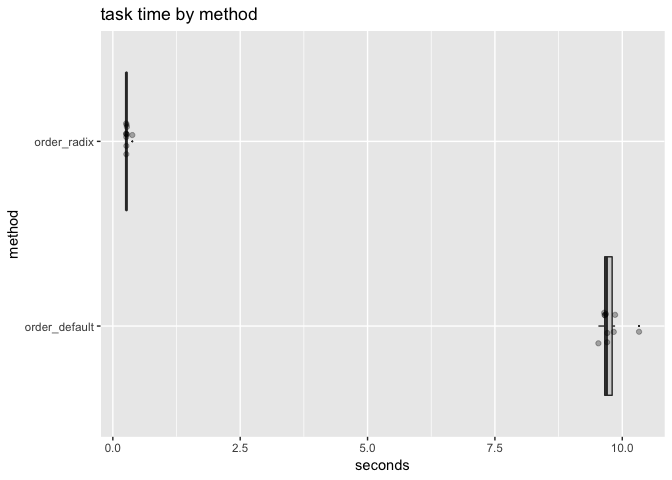

radix.Rmd
================

Late 2014 Mac Mini High Sierra 10.13.6, 8 GB 1600 MHz DDR3 RAM, R version 3.5.0 (2018-04-23).

``` r
library("microbenchmark")
library("WVPlots")
library("rqdatatable")
```

    ## Loading required package: rquery

``` r
library("cdata")

set.seed(32523)

mk_data <- function(nrow) {
  alphabet <- paste("sym", seq_len(max(2, floor(nrow^(1/3)))), sep = "_")
  data.frame(col_a = sample(alphabet, nrow, replace=TRUE),
             col_b = sample(alphabet, nrow, replace=TRUE),
             col_c = sample(alphabet, nrow, replace=TRUE),
             col_x = runif(nrow),
             stringsAsFactors = FALSE)
}

d <- mk_data(1e+6)

# adapted from help(microbenchmark)
my_check <- function(values) {
  isTRUE(all(sapply(values[-1], function(x) identical(values[[1]], x))))
}

timings <- microbenchmark(
  order_default = d[order(d$col_a, d$col_b, d$col_c, d$col_x), , 
                    drop = FALSE],
  order_radix = d[order(d$col_a, d$col_b, d$col_c, d$col_x,
                        method = "radix"), ,
                  drop = FALSE],
  check = my_check,
  times = 10L)

print(timings)
```

    ## Unit: milliseconds
    ##           expr       min        lq      mean    median        uq
    ##  order_default 9531.2865 9653.6827 9759.8929 9690.6702 9833.2170
    ##    order_radix  262.1377  263.3226  278.2547  265.1452  274.2476
    ##         max neval
    ##  10329.3520    10
    ##    382.2544    10

``` r
timings <- as.data.frame(timings)
timings$seconds <- timings$time/1e+9
timings$method <- as.factor(timings$expr)
timings$method <- reorder(timings$method, -timings$seconds)

WVPlots::ScatterBoxPlotH(as.data.frame(timings),
                         xvar = "seconds",
                         yvar = "method", 
                         title = "task time by method")
```



``` r
timings %.>%
  project_nse(., 
              groupby = "method",
              seconds = mean(seconds)) %.>%
  pivot_to_rowrecs(.,
                   columnToTakeKeysFrom = "method",
                   columnToTakeValuesFrom = "seconds",
                   rowKeyColumns = NULL,
                   sep = '_') %.>%
  extend_nse(.,
             ratio = method_order_default/method_order_radix)
```

    ##    method_order_default method_order_radix    ratio
    ## 1:             9.759893          0.2782547 35.07539

This speedup is possible because Matt Dowle and Arun Srinivasan of the [<code>data.table</code>](https://CRAN.R-project.org/package=data.table) team generously ported their radix sorting code into base-`R`! Please see `help(sort)` for details. So `data.table` is not only the best data manipulation package in `R`, the team actually works to improve `R` itself. This is what is meant by "`R` community" and what is needed to keep `R` vibrant and alive.
